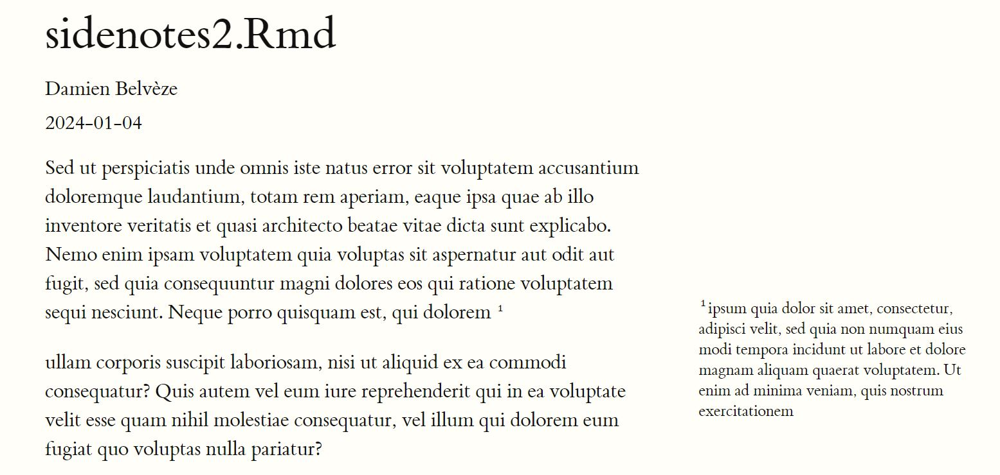

# notes de bas de page

# note de bas de page vs notes de marge

voir promotion des notes de marge par [[Arthur Perret]] dans sa thèse sur Paul Otlet[[@perretHeritageEpistemologiquePaul2022]]

Voir le [style de Tufte](https://bookdown.org/yihui/rmarkdown/tufte-handouts.html) (défini pour l'imprimé par [[Edward Tufte]] qui favorise les notes de marge plutôt que les notes de bas de page.
Pour voir une application de ce style avec du [[R (logiciel)||Rmarkdown]], voir cette vidéo[[@bryanjenksRMarkdownReportsMultiple2020]]

Les notes formatées en markdown pour apparaître en bas de page apparaissent automatiquement en marge quand le lien a été fait dans l'entête [[YAML]] avec le package tufte chargé dans R

Autre possibilité : utiliser un filtre conçu pour [[Pandoc]] par [Jez](https://github.com/jez/pandoc-sidenote)
Ce filtre est un paquet Haskell (comme Pandoc lui-même) et peut être installé avec l'outil Cabal pour Linux ou Stack pour Windows (on installe stack avec Chocolatey)

Pb : https://github.com/jez/pandoc-sidenote/issues/31

$\newline$
# bibliographie
$\newline$

