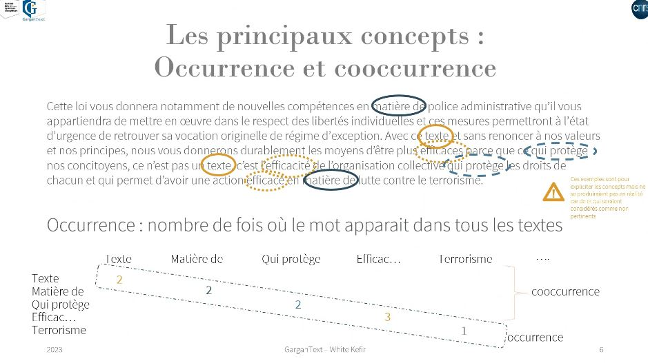
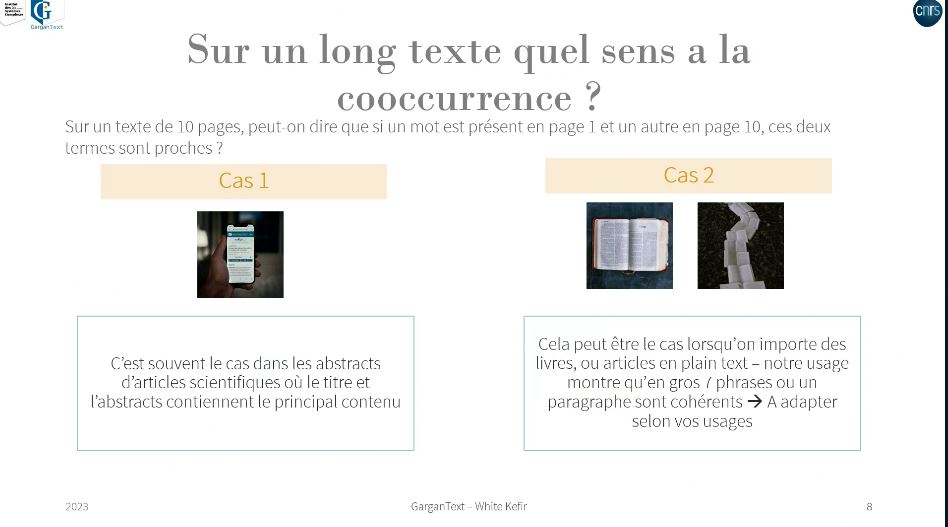
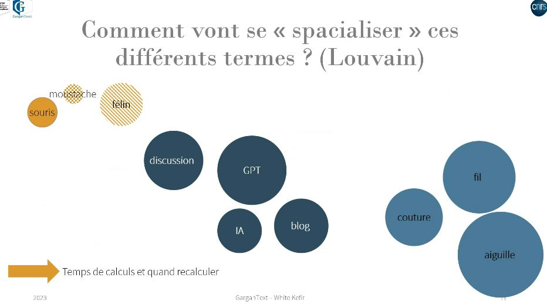

gestion des occurrences et co-occurrences dans [[Gargantext]]

Question de la proximité des termes co-occurrents : 

Gargantext : 7 phrases constitue pour cet outil un ensemble co-occurrent. 

cluster à partir d'occurrences
chat -> souris, moustache, tigré, litière (= 1 cluster)
chat -> conversation, GPT, discussion, bot (= 1 deuxième cluster)

Plus les mots sont présents ensembles et plus ils s'attirent, moins ils sont présents ensemble et plus ils s'éloignent. 
Spatialisation de Louvain. 

$\newline$
# bibliographie
$\newline$

