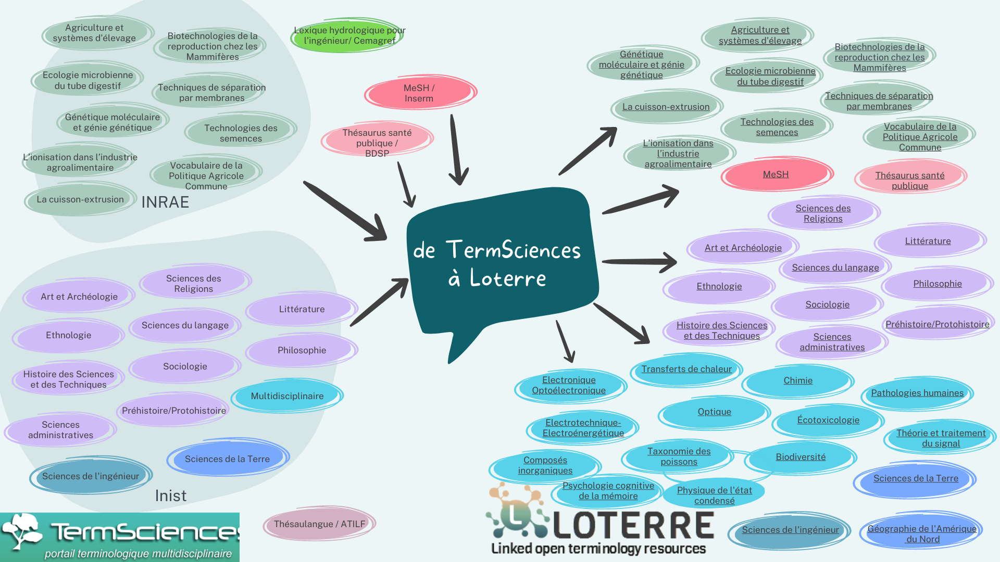

classe d'objets ou [[entités]] permettant de mettre ces objets en relations les uns avec les autres. Ces classes d'objets permettent de caractériser à plusieurs niveaux des expérimentations. Les ontologies sont utilisées dans le cadre de la gestion des données, pour caractériser chaque jeu de données et les mettre en relation les uns avec les autres selon les méthodes du [[web sémantique]]

> The true meaning of ontology is tied to the centuries long discourse of philosophers asking the question ‘what is’ and to the problems that arose from their various answers. Engaging in that discourse would be out of the scope of this paper, and oftentimes confuses the domain users of ontologies. Instead, we will follow a less philosophical but more pragmatic definition of ontology, which has had a significant impact on information science, and which defines ontology as a formally specified conceptualization that is focused on answering the question of what can be represented in a specific domain

source : https://www.degruyter.com/document/doi/10.1515/pac-2021-2007/html 

ontologies supérieures vs ontologies de domaines

Ontologies supérieures (upper ontologies) sont des généralités transdisciplinaires : temps, espace, objets, procédés, qualités, informations / relations : causalité, dépendance au temps ou à l'espace, partie d'un tout

Les ontologies de domaine, sont propres au domaine de recherche considéré : 
en chimie par exemple : substances chimiques ou procédés chimiques. 

ontologies interdisciplinaires, par exemple ontologie pour la description du relief [[@AR04OntologiesPour]]

Certaines pratiques (comme dans cet exemple la radiothérapie) sont limitées par les difficultés d'échanges entre praticiens sur des thérapeutiques qui sont insuffisamment codifiées. D'où le besoin de réunir les vocabulaires existants en une seule ontologie (communication humaine mais aussi machine ([[@phillipsOntologiesRadiationOncology2020]])

# Lien avec le web sémantique

Les ontologies utilisées en Science sont peu ou prou configurées pour fonctionner avec la norme [[RDF]] : triplon sujet/prédicat/objet 

une ontologie doit avoir les propriétés suivantes : 
- réalisée par les experts de la discipline
- développée selon les principes [[FAIR]]
- utilisée dans des applications (bases de données, articles scientifiques)

Les ontologies sont répertoriées dans des portails comme [Ontobee](https://ontobee.org)

## Loterre : Le dictionnaire INIST des ontologies

voir [[Loterre]]

Les thésaurus dans chaque discipline peuvent être téléchargés et partagés (ce qui est nouveau par rapport à l'ancien dictionnaire technique termsciences.fr)
Toutes les ontologies n'ont pas été créées par l'INIST, on trouve dans le lot des ontologies de l'INRAE, du NIH... (le [[MeSH]] pour les Sciences Médicales, Ascodopsy pour la santé mentale, le [[thesaurus]] de la Santé publique de la BDSP, des terminologies de l'INRAE, Prodig, le vocabulaire de la géographie)
[Loterre](https://www.loterre.fr/) est disponible en ligne depuis le 14 avril 2023
# par disciplines

## chimie

ontologies en chimie: 

Classes:
- molécules
- atomes, 
- réactions, 
- outils d'expérimentation, 
- méthode expérimentale, 

La molécule de dioxyène est une instance de la classe "molécules"

MassSpectrometer is_a Device (taxonomie)
MolecularProcess has_part MolecularEntity (méronomie)

# réaliser une ontologie

méthode de travail : ontoclean
$\newline$
# bibliographie
$\newline$

