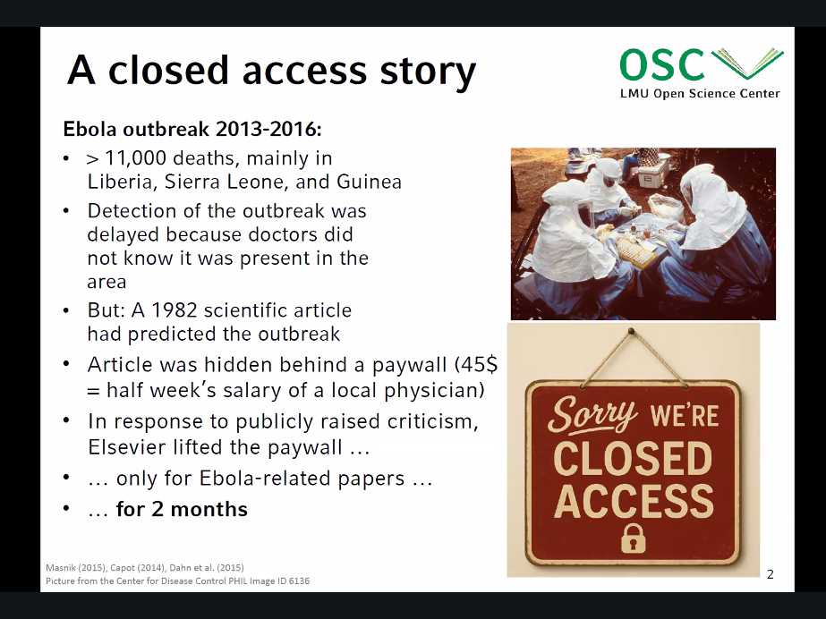

# L'open access au bénéfice de la société

# contexte politique favorable ou défavorable à l'open access

## Guerre et Open Access 

On peut craindre en effet que la Science Ouverte pâtisse de l'extension du secret Défense sur un nombre de plus en plus important de sujets et que, dans un contexte de guerre hybride, le champ d'application du "autant fermé que nécessaire" s'accroisse dans la même mesure.

Mettons de côté les chercheurs et chercheuses qui répondent à des appels à projet explicitement tournés vers des intérêts militaires et savent en théorie ce qu'ils ou elles font (et l'assument, on peut l'espérer), il n'en reste pas moins que comme disait Lacoste, "la géographie ça sert d'abord à faire la guerre" et si on étend cette logique à d'autres champs que la géographie et à d'autres produits de la connaissance susceptibles d'être arsenalisés, on peut se réjouir (ou espérer ?) que les doctorant.e.s soient plus souvent sensibilisés que par le passé à ces enjeux éthiques et perçoivent les potentialités stratégiques de leurs productions, notamment dans le domaine des sciences cognitives, terrain de jeu favori de la guerre hybride.

  

L'usage militaire des connaissances n'implique pas forcément une clôture des publications qui d'ailleurs s'avèrerait préjudiciable aux chercheurs d'un même "camp".

D'une part puisque les chercheurs et chercheuses ont pris l'habitude de se partager les résultats de leurs recherches quand des intérêts commerciaux les maintiennent enclos, on voit mal comment cette habitude cesserait même dans un contexte de guerre plus marqué. C'est même le sens d'une communauté scientifique de ne pas s'arrêter aux frontières nationales.

D'autre part, les protections techniques qui permettent d'accorder l'accès à l'article sur la base d'une IP paraissent facilement contournables. Mais même si ce filtrage était opérant et coupait vraiment les publications de leur lectorat à l'extérieur de l'Académie, dans la mesure où la Science Ouverte est un levier de croissance important et a été largement financée à partir du moment où elle a été perçue comme tel, on voit mal comment les Etats pourraient renoncer à ce levier en restreignant l'accès à un grand nombre de publications susceptibles aussi de faciliter l'innovation.

  

Le plus probable est que le contexte de guerre hybride, s'il s'impose à la recherche, transforme un nombre grandissant de produits de recherche en biens à "double usage" (*dual use*), soit un usage pacifique mais aussi potentiellement guerrier selon qui s'en empare. On peut constater en effet qu'avec les licences standard qui la caractérisent, la Science Ouverte apparaît mal équipée pour restaurer aux communautés de recherche une capacité à peser sur les usages de leurs découvertes.  

  

En effet, les chercheurs et chercheuses peuvent aussi considérer que la Science Ouverte les dépossède d'une partie de leurs droits si elle permet à des acteurs militaires ou industriels, d'utiliser pour leur profit immédiat, et avec des conséquences destructrices pour les populations, l'environnement ou le climat, les résultats d'une recherche qui était motivée (du point de vue des chercheurs au moins) par la recherche de connaissances au service du bien commun.

  

On retrouve ici, dans le champ des publications et des données,  à peu de choses près, les critiques que certains militants du logiciel Libre apportent aux licences open source : à quoi bon me targuer que mon logiciel soit placé sous une licence libre si cette licence permet à l'industrie de l'armement de faire de mon code source destiné à améliorer la mobilité des personnes non voyantes un système de téléguidage pour des missiles. De là, les licences type Hippocrate ("primum non nocere") ou "excluantes" (code réutilisable par tous sauf par les entreprises qui investissent dans l'énergie fossile ou l'armement) que certain.e.s appliquent à leur code source.

  

Dans un texte paru sur AOC le 18 mai 2023, Alexandre Monnin, Eric Tannier et Maël Thomas livraient une critique de la Science Ouverte basée sur le constat d'une dépossession des chercheurs et chercheuses de leur production au profit d'intérêts délétères pour le climat et l'environnement (qu'on songe à Total, Thalès ou aux producteurs de larges modèles de langage). Selon ces auteurs, il est temps que les communautés de recherche se réapproprient d'une certaine manière le résultat de leurs recherches non pour en tirer un profit personnel mais pour l'orienter vers des communautés qui en usent dans un sens cohérent avec leurs motivations. Les auteurs proposent de travailler sur des licences excluantes (un "droit d'usage") qui selon eux permettraient de pallier les défauts des licences qui sont actuellement recommandées dans le champ de la Science Ouverte.

  

C'est une critique légitime à laquelle je souhaiterais qu'on puisse répondre sans remettre en cause tout l'acquis de la Science Ouverte qui depuis des décennies oeuvre malgré tout à une meilleure circulation des savoirs et contribue à élever le niveau de confiance des citoyens à l'égard des résultats scientifiques.

  
# Les obstacles qui ont ralenti l'adoption de l'Open Access

1. Un mode d'évaluation qui est resté trop dépendant des éditeurs et du facteur d'impact
2. Le paiement d'[[APC]] a perverti le modèle
3. pas d'alignement des politiques des bailleurs de fonds sur celles des institutions de recherche
4. Les éditeurs déjà présents sur le marché ont reçu une attention trop grande par rapport aux pure players de l'open access qui ont été négligés. Les [[accords transformants]] sont le symbole de ce problème.
5. La [[Retention Rights Strategy|stratégie de rétention des droits]] de rétention des droits n'a a été appliquée que trop tardivement, elle aurait du être présente dès le premier jour des initiatives en OA.

(source : [[@velteropWeLovedOpen2023]])

$\newline$
# bibliographie
$\newline$

