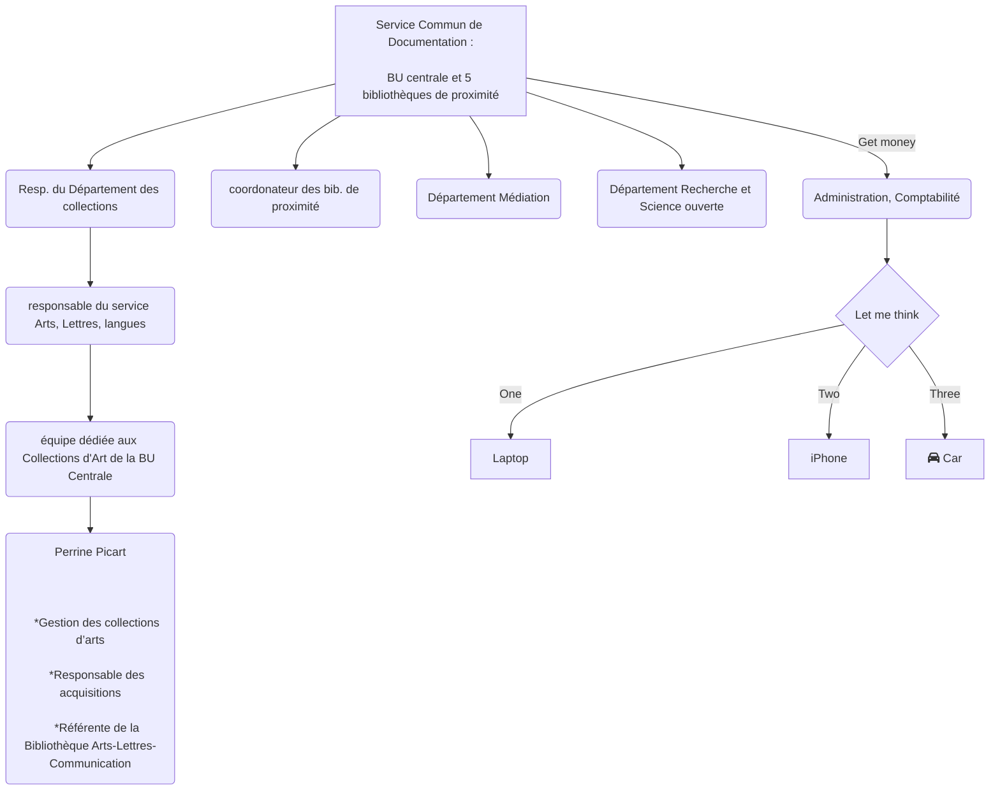

# comment créer un organigramme

# avec Mermaid

[[mermaid]]

```mermaid

flowchart TD

    A[Service Commun de Documentation :

BU centrale et 5 bibliothèques de proximité] -->|Get money| B(Administration, Comptabilité)

    A -->G(coordonateur des bib. de proximité)

    A -->H(Département Médiation)

    A -->I(Département Recherche et Science ouverte)

    A -->J(Resp. du Département des collections)

    J -->K(responsable du service Arts, Lettres, langues)

    K -->L(équipe dédiée aux Collections d'Art de la BU Centrale)

    L -->M(Perrine Picart

  

     *Gestion des collections d’arts

     *Responsable des acquisitions

     *Référente de la Bibliothèque Arts-Lettres-Communication)

  

    B --> C{Let me think}

    C -->|One| D[Laptop]

    C -->|Two| E[iPhone]

    C -->|Three| F[fa:fa-car Car]

```

$\newline$
# bibliographie
$\newline$

