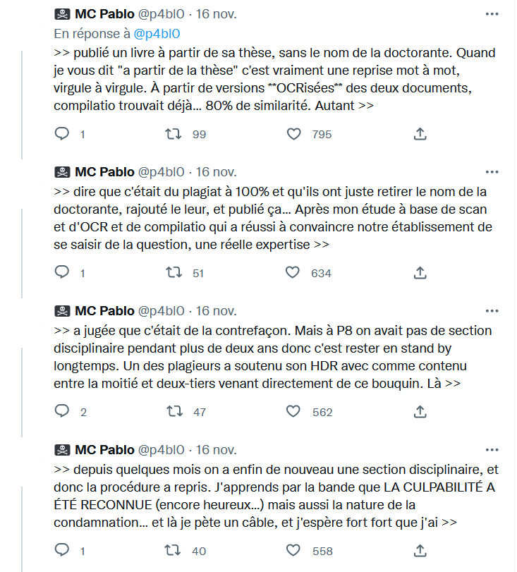
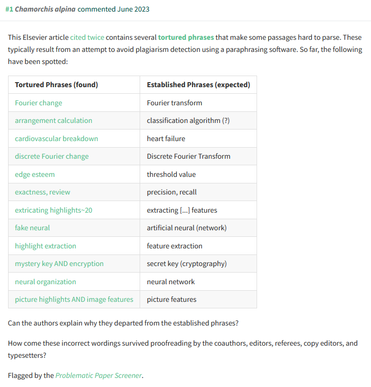
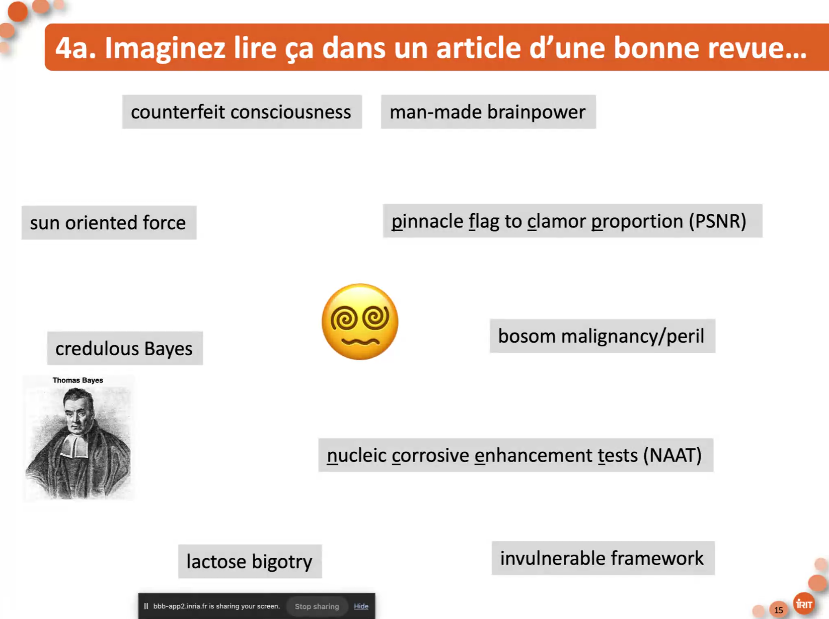

# philosophie et anthropologie du plagiat

## esthétique

Selon Harold Bloom, le plagiat est aussi l'art des poètes qui recyclent les paroles des autres, mais leur expression des idées recyclées est tellement brillante qu'elle supprime le lien avec les idées qui ont été volées[[@AphorismTwitterDistinct2022]].

> Harold Bloom’s [‘anxiety of influence’](https://en.wikipedia.org/wiki/The_Anxiety_of_Influence) thesis captured this mood fifty years ago. Put bluntly, Bloom argued that poets are ‘always already’ plagiarists by virtue of being in the verbal recycling business. They just hope they don’t get caught as the brilliance of their own syntactic arrangements overshadows those from whom they have secretly stolen. This was a radically new spin on the idea of ‘tradition

# Le plagiat à l'université

## causes du plagiat

## plagiat des encadrants

>Dans une enquête sur l’expérience doctorale effectuée auprès de plus de 11 500 [[doctorants]], 15 % des personnes interrogées se disent insatisfaites ou très insatisfaites de la manière dont leur directeur veille à ce que leurs travaux soient bien crédités 

(source: [[@AliceRaybaudPlagiatvolappropriation2022]])

# moyens de prévention et répression

## repérage des textes plagiés

### phrases torturées

Le texte d'origine a été reproduit, mais on a changé certaines formulations pour cacher l'emprunt au détecteur de similitudes. Au lieu des expressions convenues, on a des circonlocutions peu courantes dans le champ scientifique, ce qui attire la suspicion : 

(source : https://pubpeer.com/publications/2F9EF73C66DE0574DA0E63B1CE3F64 à propos de 10.1016/j.matpr.2021.06.379)

cf aussi [[panorama des méconduites scientifiques et contrefeux pour déjouer les pièges]]

outil utilisé pour déguiser du plagiat : [spinbot](https://spinbot.com/)

outil utilisé pour générer des "maths" au kilomètre : [mathsgen]()

Ces synonymes sont générés avec un ordinateur. C'est ainsi qu'une "colonie de fourmis" devient un "Etat souterrain et rampant" source : https://twitter.com/DianaMKwon/status/1471224775104253962

Un site tenu par Guillaume Cabanac aide à recenser les articles qui comportent ce type de phrases alambiquées (papiers commentés sur [[Pubpeer]] et répertoriés par [[Guillaume Cabanac]]) : https://dbrech.irit.fr/pls/apex/f?p=9999:12:::NO:::

intelligence artificielle et génération automatique d'articles : https://fediscience.org/@ct_bergstrom/112100342696061125 également https://pubpeer.com/publications/F93A8D69350BC6B12AB48B132161A7
génération automatique de peer-reviews : https://arxiv.org/abs/2403.07183

## Détection de textes générés par des IA

mutation sémantique du concept de plagiat pour lui permettre d'englober les cas de [[ghostwriting]] et d'usages non transparents d'intelligence artificielle génératives : 

> [As someone who was the victim of plagiarism hundreds of times](https://www.plagiarismtoday.com/2006/05/13/featured-article-my-first-plagiarism-battle/), I can say with certainty that it does feel very much like theft, and like a very personal one at that. 
> 
> But the plagiarism as theft narrative omits a great deal of things that we consider plagiarism. For example, a student using an essay mill or having another student write their paper is a form of plagiarism, but the “victim” isn’t a victim, they’re a conspirator. 
> 
> If plagiarism is purely theft, why can’t students use essay mills? Why don’t all authors use ghostwriters? Why would anyone who can afford it ever write anything original?

(source: https://www.plagiarismtoday.com/2023/04/11/one-way-ai-has-changed-plagiarism/)

Il y a bien une personne lésée (puisque ce n'est pas la source ni dans le cadre du ghost writing, ni dans celui de l'IA). Cette personne est le lecteur ou la lectrice qui prend pour acquis que le texte qu'il/elle lit est 1. Original 2. la production de celui qui affirme en être l'auteur. C'est ce mensonge et ses conséquences qui nous permettent malgré tout de parler de plagiat dans les cas évoqués.

incapacité des outils de détection de similitudes actuels de détecter correctement, sans faux négatifs, des textes qui ont été générés avec un outil d'IA. 
Lorsque les capacités de prédiction de ces outils, comme Compilatio, ne sont pas meilleures que le hasard, le risque d'incriminer quelqu'un pour génération de texte par une IA est grande, ce qui rend inopérant pour l'instant l'application de ce test de détection à tous les documents soumis par les étudiants comme c'était le cas pour du plagiat. 
[[@dessusDetectionUtilisationRobots]]

outil d'IA permettant de rendre plus difficilement détectable un texte généré par une IA : https://writehuman.ai/

concept de smoking gun ([[Guillaume Cabanac]]) : quand le bouton "regenerate answer" apparaît dans le texte. 
Concept de références hallucinées (voir [[hallucination]])

# bibliographie

