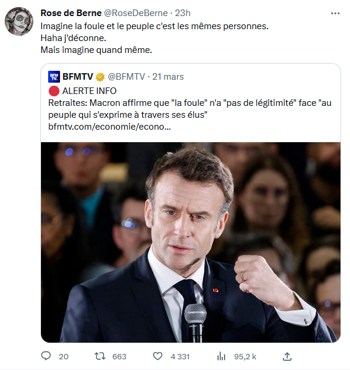

voir aussi [[populisme pénal]] et [[populisme scientifique]]

 22 mars 2023, suite aux [[Manifestation|manifestations]] en réaction au déclenchement de l'article 49.3 sur la réforme des retraites : 

>La foule qui manifeste n’a pas de légitimité face au peuple qui s’exprime à travers ses élus

représentation du peuple par ses élus (cf. théorie du contrat originel voir [[Etat#le contrat originel]])

Gérard Bras, là-dessus, s'inscrit en faux contre la théorie de [[Geoffroy de La Gasnerie|Geoffroy de Lagasnerie]] : 

> Tout discours qui verrait dans ce mode de gouvernement [[démocratie représentative|représentatif]] une mystification visant à faire prendre les vessies du despotisme pour les lanternes de la démocratie (parlementaire) contribue à l’impuissance politique du peuple, à renvoyer les simples citoyens à l’incompétence au nom de laquelle ils sont confinés dans leur statut de dominés

(source [[@brasFouleContrePeuple2023]])

Le peuple n'est pas une entité consensuelle mais un collectif traversé de conflits (cf. Chantal Mouffe (voir [[antagonisme vs agonisme]])
Pour [[Chantal Mouffe]], le peuple n'est pas non plus une catégorie sociologique, mais une "construction discursive possédant une dimension symbolique et libidinale" ([[@mouffeRevolutionDemocratiqueVerte2023]], p97)

sur l'agentivité du peuple, (voir [[agentivité#le peuple acteur de son histoire ?|agentivité]]).
Pour Gérard Bras, le peuple n'est pas seulement l'auteur des lois à travers ses représentants qu'il contrôle tout de même un peu (reddition des comptes), ( voir [[démocratie représentative]]), il veut désormais infléchir directement cette action législative : 

> « peuple » ne nomme pas seulement le principe de la souveraineté, mais aussi cette force matérielle capable de modifier les décisions d’un gouvernement, fût-il légal, de renverser les institutions en place, de jouer un rôle déterminant dans la constitution politique de la nation. Les révoltes populaires pouvaient être destituantes. Les modernes révolutions, les grandes manifestations de rue, où l’on voit des multitudes agir en peuples, prétendent être constituantes. En ce sens ces _peuples acteurs_ ne se laissent pas ramener aux foules plébéiennes en révolte sous l’Ancien Régime.

Face à ce nouveau positionnement du corps politique que sont l'ensemble des citoyens, les politiques élus adoptent la stratégie de faire passer le "peuple dans la rue" pour une foule irrationnelle.

Pour les gouvernants, le populisme est le terme utilisé pour s'attaquer à tout mouvement populaire qui viendrait revendiquer à l'encontre du décret du "peuple souverain", c'est à dire de la représentation nationale. 

Pour les intellectuels, Margaret Canovan a bien identifié que le populisme était le miroir de ses orientations politiques : un monstre issu d'une perte de contrôle sur le jeu démocratique pour les auteurs qui ne se résignent pas à voir le peuple jouer le rôle qui lui revient en démocratie, un idéal de simplicité et de vertu pour les intellectuels qui font l'éloge des hommes simples et forts. [[@cholletAntipopulismeOuNouvelle2023]], p90)

La légitimité d'une assemblée ou d'un gouvernement n'est pas acquise elle se construit : 

> La légitimité démocratique n’est pas définie formellement par le droit constitutionnel. Elle résulte d’une tension, voire d’une contradiction entre ces deux scènes, celle de la représentation parlementaire et celle des manifestations qui la contestent. La légitimité ne se décrète pas, elle n’est pas promue par concept : elle se gagne pratiquement. Elle est relative à l’acceptation par les dominés des décisions des gouvernants

# une conséquence de la disparition du peuple de la scène publique

Bronislaw Geremek disait que 

> le populisme exploite l'absence du peuple sur la scène politique 

(propos cité par Danièle Sallenave[[@sallenaveJojoGiletJaune2019]], p11)

# un terme polysémique

D'après Diekhof et Jaffrelot, le populisme est une [[Idéologie]] "peu substantielle" comparée à d'autres idéologies denses comme le libéralisme politique, le fascisme ou le communisme. 
qui mobilisent un socle de valeurs plus diverses et un argumentaire plus fourni
Une idéologie comme le populisme peut donc contenir plusieurs idéologies denses (dans un mouvement populiste, on peut trouver des tenants du fascisme et d'autres du communisme) [[@dieckhoffPopulismesAuPouvoir2019]] cité par [[@secailTouchePasMon2024]], p52.

Pierre-André Taguieff a d'abord qualifié le Front National de populiste en 1984 en qualifiant ce parti de "national-populisme". 
Le terme s'applique d'abord pour les dénigrer aux mouvements d'extrême droite mais s'est étendu ensuite aux mouvements d'extrême gauche, selon le lieu commun qui voudrait que les "extrêmes se rejoignent". Ugo Palheta revient sur la naissance du concept de populisme en en faisant un avatar de l'accusation de XXXXXXX au moment de l'extrême droite  ; il pointe notamment le travail de Taguieff à l'origine de l'usage du terme populisme pour condamner toute politique qui se fait critique du néo-libéralisme en l'associant à des thèses qui lui sont pourtant antagonistes, c'est à dire à celles qui sont promues à l'extrême droite.[[@palhetaCommentFascismeGagne]]

## Chantal Mouffe et le populisme de gauche

A [[Gauche|gauche]], la philosophe [[Chantal Mouffe]] reprend à son compte cette appellation et place au centre du jeu démocratique l'antagonisme entre des démocrates populistes et une élite qui voudrait priver la démocratie de son élément populaire ("la compulsion à se débarrasser du peuple et de la politique" selon [[Jacques Rancière]], voir également le concept d'"[[agoraphobie]]" de Francis Dupuis-Déri.

En cela, les mouvements populistes combinent souvent deux orientations, l'une conservatrice : discours autoritaires et xénophobes, l'autre émancipatrice (remettre le peuple au centre du jeu)

Johannes Schulz observe que le populisme comporte fondamentalement deux matériaux ( [[@Corcuffgrandeconfusioncomment2021]], p205 ): 

D'un côté l'[[autoritarisme]], l'homme providentiel, le [[ressentiment]], l'essentialisation du peuple-nation
Le populisme qualifierait donc toute pensée opposant le peuple pur essentialisé et l'élite corrompue. 

## La finance autoritaire cachée derrière le populisme d'extrême droite

si l'analyse de Mouffe et Laclau sur un raidissement anti-néolibéral et autoritaire des classes populaires qui souffrent directement du cycle des réformes néo-libérales enclenché au début des années 80 est intéressante pour la Gauche et devrait lui permettre de renouer avec ces classes populaires en abandonnant son référentiel néo-libéral et en réinstaurant de la conflictualité avec les forces qui représentent le modèle économique dominant, cependant des chercheurs montrent que la finance a un intérêt objectif à nourrir le populisme d'extrême droite et ne s'en prive pas. 
Vladimir Bortun de l'Université d'Oxford et Théo Bourgeron, de l'Université de Nanterre, étudient le tournant matérialiste du populisme, c'est à dire, quelles forces économiques soutiennent les courants populistes d'extrême droite. Il se trouve que c'est la Finance qui nourrit les mouvements populistes autoritaires et que le grand patronat n'est pas étranger, loin de là, à la radicalisation du discours d'extrême droite, souvent beaucoup plus par intérêt, que par conviction religieuse ou politique. 
Ainsi, Théo Bourgeron, montre comment le grand patronat français (Stérin, Bolloré, Charles Gave) subventionne les médias d'extrême droite pour protéger leurs super-profits ([[@bourgeronGrandPatronatExtreme2024]])

De l'autre, une demande de dignité, de [[justice sociale]] et de démocratie

Pour Antoine Chollet, le populisme est un terme extrêmement vague, que les sciences politiques ont généralement déconnecté de son histoire pour lui faire embrasser des réalités présentes très hétérogènes et parfois contradictoires : Syriza, mouvement 5 étoiles, Victor Orban, Podemos, Fratelli d'Italia...
Le terme embrasse tout, et selon Antoine Chollet, la meilleure manière de comprendre ce qu'est le populisme, c'est en étudiant la rhétorique anti-populiste [[@cholletAntipopulismeOuNouvelle2023]]. 
Cette rhétorique a recours au terme de populiste pour disqualifier tout mouvement ayant la prétention de remettre le peuple au centre du jeu. Ce qui se joue à travers ces discours (et c'est le cas depuis le 19ème siècle), c'est une méfiance à l'égard du processus démocratique en tant que tel. Cette approche est également partagée par Dupuy-Déri quand il analyse l'histoire du parti démocrate aux USA dans *Démocratie. Histoire politique d'un mot*. 
Dupuy-Déri y analyse la réduction progressive de la démocratie à sa dimension représentative (avec les Grands Electeurs)

Antoine Chollet remet en cause une analyse politique trop souvent [[agoraphobie|agoraphobe]] qui confond sous le même vocable le culte du chef et la remise en cause de la démocratie parlementaire qui caractérisent l'extrême droite et une demande de participation plus grande des citoyens à la vie démocratique, une critique de la professionnalisation du personnel politique et des logiques anti-démocratiques qui grèvent la vie des [[partis politiques|partis]]. 

> La dénonciation de la confiscation du pouvoir par une classe politique trop étroite, les demandes visant une plus grande participation des citoyens et citoyennes aux affaires publiques, les propositions de nouvelles procédures pour y parvenir (comme le référendum ou les assemblées citoyennes) provenant des mouvements qui émettent ces critiques n'ont pas du tout le même sens politique que les discours de l'extrême droite, même s'ils peuvent parfois sembler comparables à l'analyse distrait

(source : [[@cholletAntipopulismeOuNouvelle2023]], p23)

plus à ce sujet : [[antipopulisme]]

# Bibliographie
