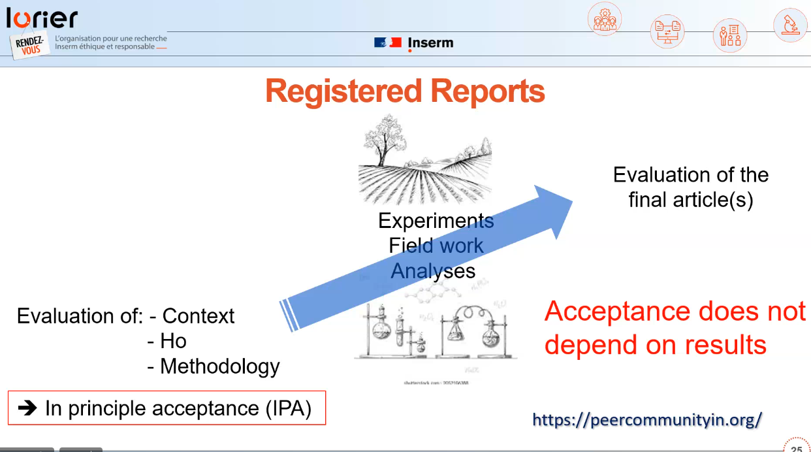

> the plan for a research study, including research questions/ hypotheses, details about the research design, and/ or plans for data analysis, which has been made available for public sharing in order to ensure unbiased reporting and support the differentiation of planned and unplanned research directions

(source: [[@plosNewOpenScience2024]])

Mesure phare de la Science Ouverte depuis la publication d'un numéro spécial de Social Psychology qui ne publiait en mai 2014 pour la première fois que des articles dont les méthodologies avaient été pré-enregistrées et revues par les pairs. 10 ans plus tard, en dépit d'un discours dominant sur la [[science ouverte]], les études faisant l'objet d'un pré-enregistrement sont toujours minoritaires. 

Le pré-enregistrement est pourtant un moyen efficace de lutter contre le [[biais de publication]] sous toutes ses formes, notamment le [[p-hacking]] ou le [[p-harking]]
(source : [[@brownFixingScienceMeans2024]])

Mais il pose une contrainte importante sur les chercheurs qui doivent se plier à une déclaration de plus en plus rigoureuse de leurs objectifs initiaux et des méthodes pour y parvenir. Or ces méthodes démontrent parfois leurs limites au moment de la collecte de données et il n'est à ce stade plus possible d'en changer. Les buts de l'étude doivent être clairement établis, ce qui a manqué précisément dans une étude qui a été rétractée alors qu'elle prétendait assurer toutes les conditions jugées favorables à sa reproductibilité

> “replicability was not the original outcome of interest in the project, and analyses associated with replicability were not preregistered as claimed

(source : [[@elseDoingGoodScience2024a]]

(voir [[Publier en bonne entente et hors des revues prédatrices]])

# Registres de pré-enregistrement : 
- [[Prospero]] (méta-analyses)
- [[Zenodo]],
- [[osf.io]]
- clinicaltrials.gov ([[études cliniques]])

$\newline$
# bibliographie
$\newline$

