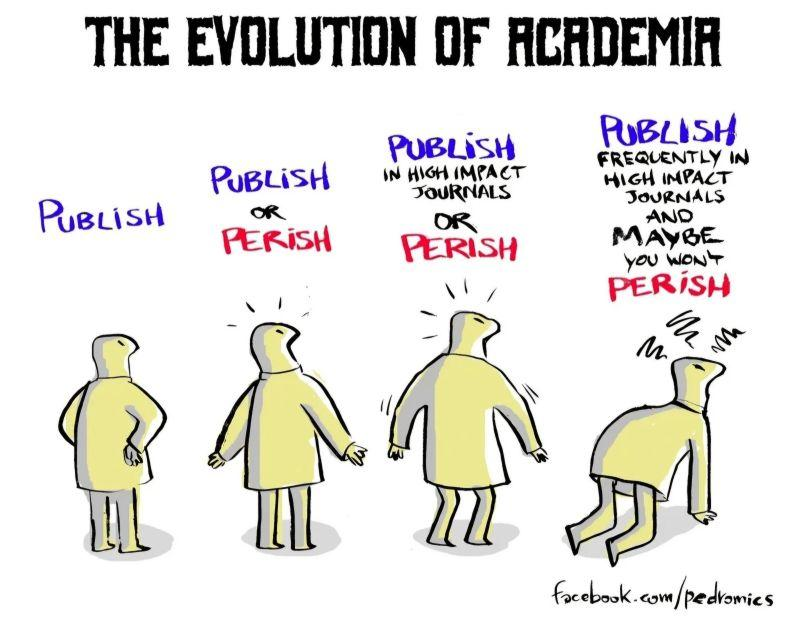

# la pression à la publication sur le chercheur

augmentation drastique du nombre de publications (correllée à une certaine baisse de qualité) : 

> De 2016 à 2022, le nombre d’articles scientifiques publiés dans le monde est passé d'environ 1,9 millions par an à 2,8 millions, soit une augmentation de 47 %, alors que le nombre de chercheurs n'a guère évolué

source : https://www.inrae.fr/actualites/ledition-scientifique-pression

## impact factor

L'impact factor est un indicateur de qualité d'un journal et pas d'un article, encore moins d'un chercheur. 

la pression exercée sur les chercheurs est la cause de la multiplication de fraudes (cf. [[conférence de François Canonne-Hergaux]]conférence de François Cannone-Hergaux)

## la pression à la publication sur l'organisme

Depuis 2016, le SIGAPS est un modèle d'attributions de crédits qui avantage les organismes de recherche médicale qui publient le plus d'[[études cliniques]]. 
Plus on publie, plus on est cités et plus on obtient des crédits pour faire tourner l'institut. Pendant la crise du [[Covid-19]], les travaux souvent douteux de Didier Raoult ont ainsi assuré l'IHU et au-delà l'AP-HM de Marseille d'une manne conséquente, ce qui lui a permis d'obtenir des moyens pour publier encore davantage...
Le rythme des publications est encore accéléré de manière artificielle (et le score [[SIGAPS]] accru) quand on maîtrise parfaitement l'écosystème de publications dans son domaine au moyen des [[revues népotiques|revues de complaisance]] ([[@larousserieLancetgatePublierBeaucoup2020]]).

Quand la peur de se faire doubler amène à des sorties de route : https://mastodon.social/@brembs/113951523508971775

## la pression à la publication sur les doctorants

En Chine (et bientôt chez nous ?), l'obsession de la publication épuise les [[doctorants]], les détourne de sujets moins en vogue mais plus importants sur le long terme, complique la collaboration entre chercheurs et se fait au détriment de l'acquisition d'un savoir-faire pédagogique pourtant essentiel à la tâche d'enseignant-chercheur[[@faureWhenPublishingBecomes2022]] [https://dgxy.link/ynlPb](https://dgxy.link/ynlPb "https://dgxy.link/ynlPb") [#SlowScience](https://mamot.fr/tags/SlowScience)

# l'éclipse du savoir

[[Lindsay Waters]] disait "est-ce qu'un arbre de la forêt tombe vraiment s'il n'y a personne dans cette forêt pour le voir ou l'entendre tomber ?"
Une grande partie des articles qui sont produits par les chercheurs pour entrer dans le cadre du publish or perish, sont de piêtre qualité.
Le Gold Open Access aggrave ce cas, puisque les paiements de frais de publication étant devenus pour certains éditeurs la plus grande part de revenus, ces derniers incitent toujours plus les chercheurs à produire et se lancent dans la rédaction de numéros spéciaux à leurs journaux pour ne pas ralentir le cours de la publication. Tout ceci se fait avec des standards de bonne qualité des données et des publications complètement dégradés et contribue le lectorat à se détourner de ces productions
En même temps, on demande aux chercheurs de produire un nombre grandissant d'information sur son travail et ses résultats (protocoles, jeux de données, scripts informatiques, etc.) Cela constitue un véritable déluge d'information qui rend les choses difficiles pour les auteurs 
Certains voient les restrictions institutionnelles à la publication comme une chance de revenir à une [[Slow Science]], c'est à dire à une science de qualité, qui mature longtemps[[@hannayStopDelugeScience2014]]. 

# bibliographie

