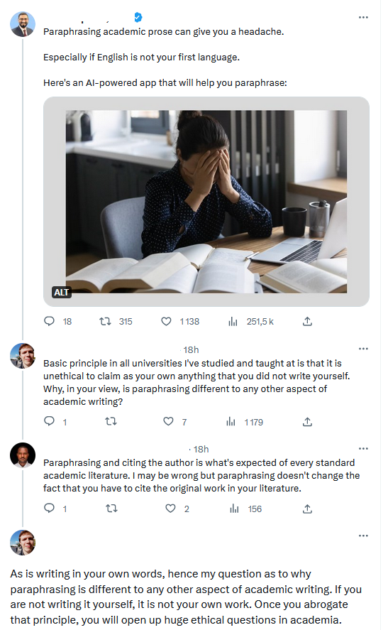

# enseigner la paraphrase

proposer à deux groupes de paraphraser chacun un extrait, puis demander à ces groupes d'échanger le travail réalisé pour paraphraser la paraphrase. 
Il y a trois versions d'un même texte : 
v1: l'original
v2: la paraphrase
v3: la paraphrase de la paraphrase

avec 3 groupes on peut obtenir 4 versions différentes.

Demander aux étudiants s'il leur semble que la v3 est restée proche de la v1 ou bien si on s'en est écarté et pourquoi ? 

méthode proposée par Song Siqi [[@songTeachingChallengingEssential2020]]

# reformuler pour s'approprier

> Prenons par exemple l'une des phrases que tu as écrites, l'autre soir, à la bibliothèque. "Je viens de recenser brièvement les maux du régime actuel", ça tu l'as lu quelque part, l'Homme de fer, ce n'est pas de toi, c'est la phrase d'un autre. On dirait qu'elle sort d'une boîte de conserve. Supposons que tu exprimes la même idée à peu près comme ça : "Mon argumentation sur l'effet de la grande propriété et la mainmise des capitaux étrangers repose sur ce que j'ai observé en Iran."

(source : Philippe Roth, j'ai épousé un communiste, p60)

# paraphrase, intelligence artificielle et intégrité scientifique

Quand on paraphrase le texte d'un auteur en le citant comme il se doit mais en utilisant un outil basé sur une [[grands modèles de langage]] générative, cela se fait-il à l'encontre de l'[[intégrité scientifique]] ? 

source: https://twitter.com/MushtaqBilalPhD/status/1681613776036978688

Discussion avec Daniel Furby : https://twitter.com/AthensFurby/status/1681631223553183744

# bibliographie
$\newline$

