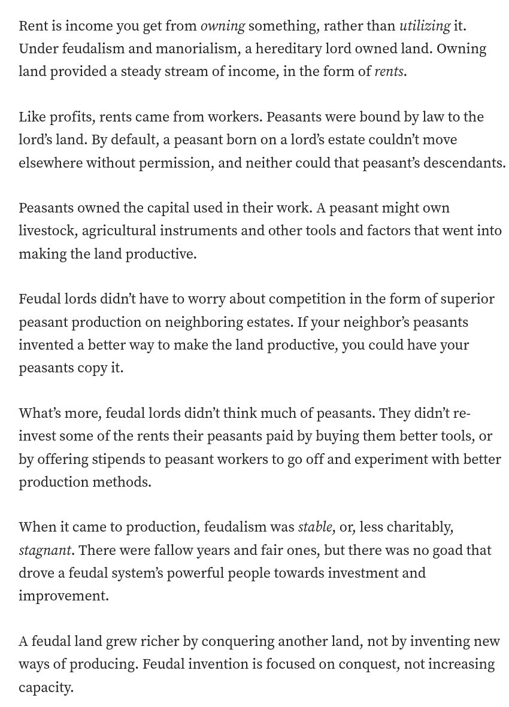

> La rente est un revenu perçu pour la propriété d’une terre, d’un actif ou d’une infrastructure, en opposition au profit généré par l’exploitation du travail. La proéminence de la rente dans l’économie numérique (brevets, captation de données, contrôle sur les technologies) marquerait ainsi la fin du capitalisme défini par l’exploitation du travail et l’extraction de profit.

source: [[@bertelloniNickSrnicekPeut2023]]
voir [[capital immatériel|brevets]] et [[accélérationisme]]

La rente, plutôt que le profit, était la source de richesse propre au [[féodalisme]] (cf. Cory Doctorow [[@doctorowInternetConHow2023]])

$\newline$
# bibliographie
$\newline$

