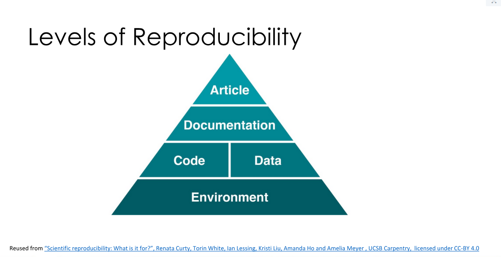
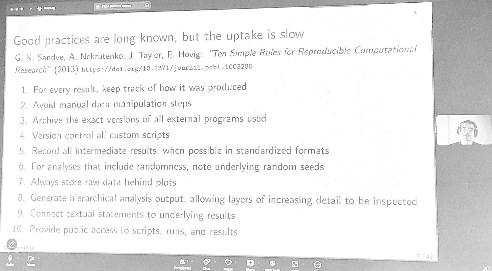

<iframe width="560" height="315" src="https://www.youtube.com/embed/Qrzkj5QmuC4?start=6" title="YouTube video player" frameborder="0" allow="accelerometer; autoplay; clipboard-write; encrypted-media; gyroscope; picture-in-picture" allowfullscreen></iframe>

# définition

La reproductibilité s'entend dans le contexte général de la Science Ouverte et de la mise à disposition des [[données de la recherche]] et du code utilisé pour traiter ces données. Cette reproductibilité a cependant des antécédents dans la nature même de la Science dont les énoncés doivent être testables pour être approuvés (cf. Travaux de [[Karl Popper]])
Pour un historique de la notion voir [[@fehrBestPracticesReplicability2016]]

Certains font une distinction entre reproductibilité et réplicabilité ([[@heiseTenSimpleRules2023]]) : 

**reproductible** : caractère d'une expérience qui peut être reproduite par d'autres en utilisant les mêmes données et la même chaîne de traitement = reproductibilité computationnelle

**réplicable** (réplicability) : caractère d'une expérience qui peut être reproduite avec des résultats cohérents et significatifs en utilisant d'autres données et éventuellement une autre chaîne de traitement. Obtenir des résultats qui signifient la même chose en utilisant des résultats similaires et des codes similaires.

> The attribute Replicability describes the ability to repeat a CBEx and to come to the same (in a numerical sense) results. Sometimes the equivalent term Repeatability is used for this experimental property. Replicability requires some basic documentation on how to run the software to obtain replicable results 

(source: [[@fehrBestPracticesReplicability2016]])

**robuste** : caractère d'une expérience qui peut être reproduite de manière significative dans un contexte différent. 

**répétable** (repeatibility) : se dit d'un code qu'on arrive à compiler dans le même environnement, avec la même méthode et en obtenant les mêmes résultats ([[@collbergRepeatabilityComputerScience2015]]), voir [[reproductibilité en compilation du code|reproducible builds]]

**réutilisable** Possibilité de réutiliser certains artefacts produits dans le cadre d'un projet de recherche pour un autre projet de recherche

Pour les différences entre ces concepts, voire [[@ziemannFivePillarsComputational2023]]

cf: https://www.scribbr.com/methodology/reproducibility-repeatability-replicability/
> A study may be reproducible but not replicable.
 A survey of 60 children between the ages of 12 and 16 shows that football and hockey are the most popular sports. Football received 20 votes and hockey 18.
 An independent researcher reanalyses the [survey](https://www.scribbr.com/methodology/survey-research/) data and also finds that 20 children chose football and 18 children chose hockey. This makes the research **reproducible**.
 The researcher then decides to conduct the study all over again. Another 60 children between the ages of 12 and 16 take part in the study. This time the results show that tennis is the most popular sport, chosen 25 times. The research is therefore not **replicable**.

voir aussi distinctions sur lesquelles se base l'INRAE dans son dispositif OSCAR  (publication de @antunesReproducibilityReplicabilityRepeatability2024) 


Dans le champ informatique, ces définitions de reproductible et réplicable sont inversées : 

> Dans une [publication de 2018](https://arxiv.org/abs/1802.03311), une recherche a été publiée pour faire la lumière sur la réplicabilité et la reproductibilité. Les deux termes sont souvent utilisés comme synonymes et, selon le domaine de recherche, ils impliquent des choses différentes.
>On peut distinguer trois cas principaux:
```
1. Les deux termes sont synonymes

2. *Reproductibilité* : les données et le code source originaux sont utilisés pour reproduire les résultats originaux. 
*Réplicabilité* : un chercheur arrive aux mêmes conclusions qu'une étude précédente en recueillant de nouvelles données

3. *Reproductibilité* : des chercheurs indépendants qui arrivent aux mêmes résultats en utilisant leurs propres données et méthodes. 
*Réplicabilité* : une équipe différente arrive aux mêmes résultats en utilisant les objets de l'auteur original
```
>Selon le domaine de recherche, on peut observer l'utilisation de ces termes avec la définition 1 en science politique et en économie ; avec la définition 2 en épidémiologie, médecine et statistiques ; avec la définition 3 en informatique.
>Notre domaine d'intérêt est le code source d'un logiciel et nous utiliserons donc la troisième définition de la **réplicabilité**.

(source : Marco Milanesio : https://gricad-gitlab.univ-grenoble-alpes.fr/gricad/cellule-data-stewardship/adld-gt5/guide-replicabilite/-/blob/main/guide_fr.md?ref_type=heads)
La reproductibilité des expériences reste aujourd'hui grandement minoritaire dans les études, et pas pertinente dans toutes les disciplines, ce qu'on pourrait souhaiter partout en revanche pour faire avancer la cause de la [[Science ouverte|science ouverte]], c'est avant tout une recherche plus transparente faite avec des outils qui facilitent cette transparence.

# pyramide de la reproductibiltié


# La crise de la reproductibilité, un indice que le système de publication est à changer

la [[crise de la reproductibilité]] (replication crisis) est le constat qu'en médecine, 50% des résultats publiés ne sont pas reproductibles. Ce manque de reproductibilité est liée à des problèmes de contrôle qualité et à un manque d'ouverture en matière de publication des données et des résultats. 

> Evidence suggests that the most prestigious journals, the ones where researchers must publish in or perish, are partly responsible for the observed lack of reliability by capitalizing on surprising, too-good-to-be-true results and lacking proper quality controls

(source[[@brembsReplacingAcademicJournals2021]])

# là où la reproductibilité des expériences n'est pas possible

> Dans des disciplines se préoccupant de l’humain dans son contexte social ou professionnel la reproductibilité des résultats de la recherche n’est pas toujours possible.  En effet, un même contexte d’observation peut varier sous l’influence d’évènements externes - qu’ils soient politiques, sociologiques, environnementaux, etc. Dans ces disciplines, qui s’ancrent dans des postures épistémologiques le plus souvent relativistes ou constructivistes, les critères de validité reposent davantage sur la généricité et de traçabilité du processus cognitif de création de la connaissance.  
   Cette situation se retrouve dans certaines recherches en informatique centrée sur l’humain en contexte spécifique (e.g. Environnement Informatique pour l’Apprentissage Humain). Pour garantir la traçabilité et la généricité de ces travaux les « Sciences de l’artificiel » peuvent être mobilisées ainsi qu’une méthode de conduite de la recherche le Design Based Research (DBR).

(annonce d'une conférence de Nadine Madran, 29 novembre 2024)

Notes de la conférence : 

tests statistiques réalisées en sciences qualitatives : est-ce que ça a un sens. 
Créer des outils pour l'informatique centrée Humain : mobiliser des usagers en tenant compte de leur environnement familial et professionnel, de leurs compétences sous-jacentes. 

Cf. Recherche sur la conception de [[jeu sérieux|jeux sérieux]]. 

serious game : difficile d'articuler l'aspect pédagogique et l'aspect ludique. 
production d'outils pour faciliter la conception collaborative de jeux sérieux : 
- jeu de cartes
- évolution vers des outils numériques. 

Etude des artefacts, étude de leur évolution selon leur contexte = "science de l'artificiel" (Herbert Simon) différent des Sciences de la nature. 

Les utilisateurs vont permettre d'évaluer ces outils de voir comment ils se les approprient ou pas. 
Qu'est-ce qu'on va pouvoir mesurer ? avant : attentes, besoins, pratiques / après = utilité, utilisabilité, acceptabilité. 

Ces indicateurs sont assez stables, objectifs et très standardisés. 

Recherche de Benoît Martinet : définition d'hybridation et mise au point d'un artefact. Validation de la définition et du modèle théorique par des utilisateurs. 

En quoi une telle expérience est-elle reproductible ? 

Enquête faite en 2016 auprès de 1500 scientifiques : arrivez-vous à refaire leur propre expérience ou celle de leur collègue. 

[[épistémologie]] en Sciences des artefacts

- réalisme critique : la réalité n'est pas observable mais elle existe indépendamment de l'humain, ce qui l'est ce sont des événements et ce qui les déclenchent. 
- constructivisme pragmatique : modèles intelligibles permettant de construire ce qui se produit dans un système


# Reproductibilité des analyses de données


(source : https://nfdi.social/@daphne/113151858369992127)

## Services destinés à rendre les résultats plus reproductibles

### Cascad (Sciences économiques)

L’agence [cascad (CNRS UAR2007)](https://www.cascad.tech/) intervient en tant que tiers de confiance (third party verificator) auprès de revues d’économie-gestion, de sciences politiques et de statistique afin d’évaluer la reproductibilité des articles conditionnellement acceptés pour publication. Les éditeurs de ces journaux sollicitent cascad lorsque les recherches sont basées sur des données confidentielles ou lorsqu’ils n’ont pas toutes les ressources ou l’expertise nécessaires afin de faire la vérification. La demande de certification cascad peut également émaner directement des auteurs d’un article scientifique, avant de soumettre leur article à un journal scientifique.

données chargées par l'équipe de recherche dans le serveur du CASD, accès sécurité accordé pendant deux jours à Cascad. Cascad essaie de regénérer les résultats à la demande d'une équipe ou d'un journal et s'il y parvient accordera une certification à l'étude (RRR = maximum de reproductibilité)
Analyse par Cascad des problèmes de reproductibilité survenues dans l'étude Fincap (mêmes données accessibles à tout le monde, 168 équipes de recherche travaillent à répondre sur ce jeu de données unique à 6 questions de recherche et envoient leurs résultats à Cascad, Cascad mesure la reproductibilité des résultats envoyés (49% des résultats étaient effectivement reproductibles)), voir étude Fincap [[@perignonComputationalReproducibilityFinance2024]]
[[@perignonComputationalReproducibilityFinance2024]]
Cascad permet de dépasser les conflits d'intérêt qui peuvent être reprochés aux éditeurs (liens avec les auteurs), Cascad peut intervenir de manière neutre que ce soit pour des chercheurs renommés ou pas. 
Cascad financé par le CNRS, très sollicités. historiquement le service était fourni à titre gracieux, maintenant il faut que Cascad fasse une offre de service payante pour les journaux (pas pour les chercheurs a priori). L'expérience acquise avec les journaux permet à Cascad de se faire reconnaître comme tiers de confiance. 


# reproductibilité du code

sur la [[reproductibilité en compilation du code]], voir intervention de Chris Lamb (Reproducible Builds)

> computational reproducibility is the ability to use the materials from a past study (such as data, code and documentation) to regenerate the outputs including figures and tables to confirm the study’s findings

(source [[@ziemannFivePillarsComputational2023]] )

## reproductibilité des expériences réalisées avec des IA

voir conférence de [[Stéphane Bortzmeyer]] sur ce qu'il faut documenter et fournir comme information quand on veut rendre une étude réalisée avec un LLM reproductible. 

([[AI reproducibility]])


# Les 5 piliers de la reproductibilité

(d'après [[@ziemannFivePillarsComputational2023]] )

## premier pilier : Programmation lettrée

voir [[programmation lettrée]]

## deuxième pilier : contrôle de version et partage

## troisième pilier : contrôle de l'environnement de la compilation 

(voir [[reproductibilité en compilation du code|reproducible builds]])

## quatrième pilier : partage de données pérennes

## cinquième pilier : documentation

