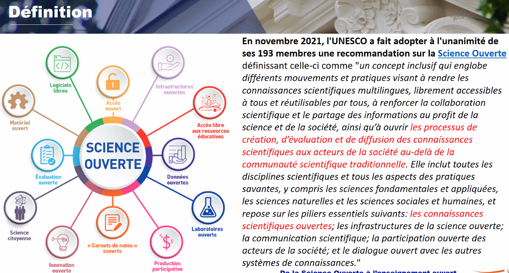
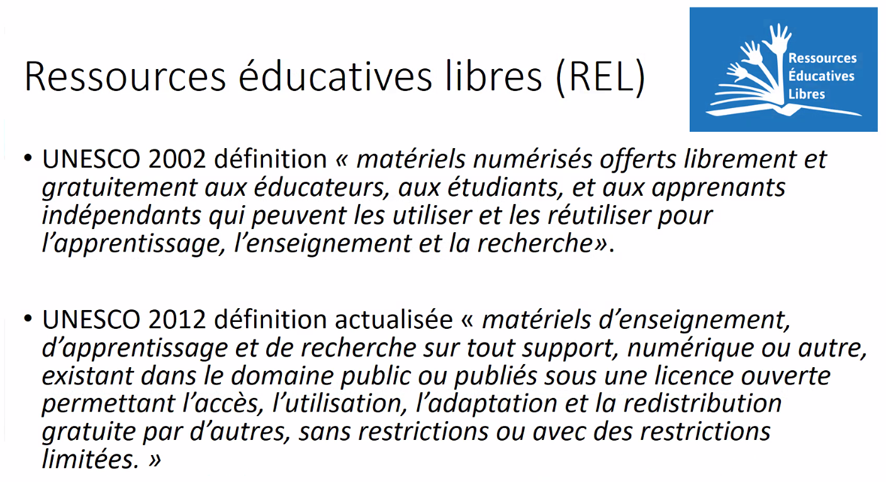
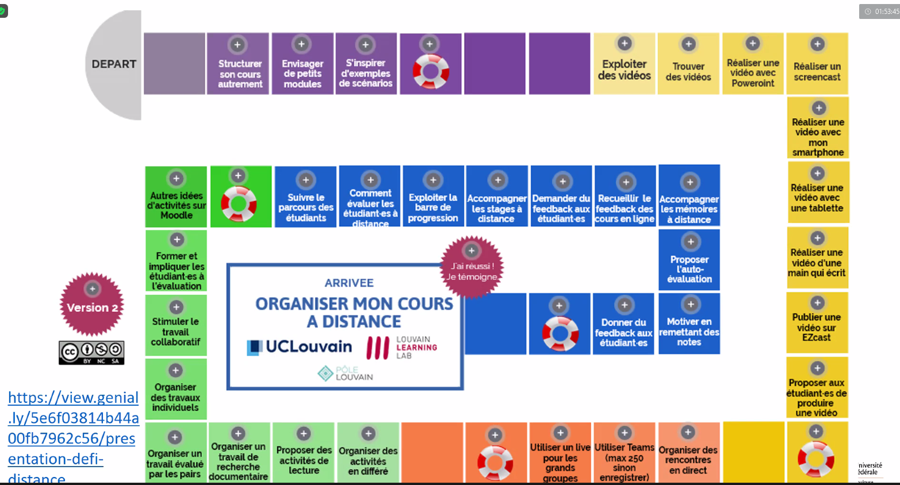
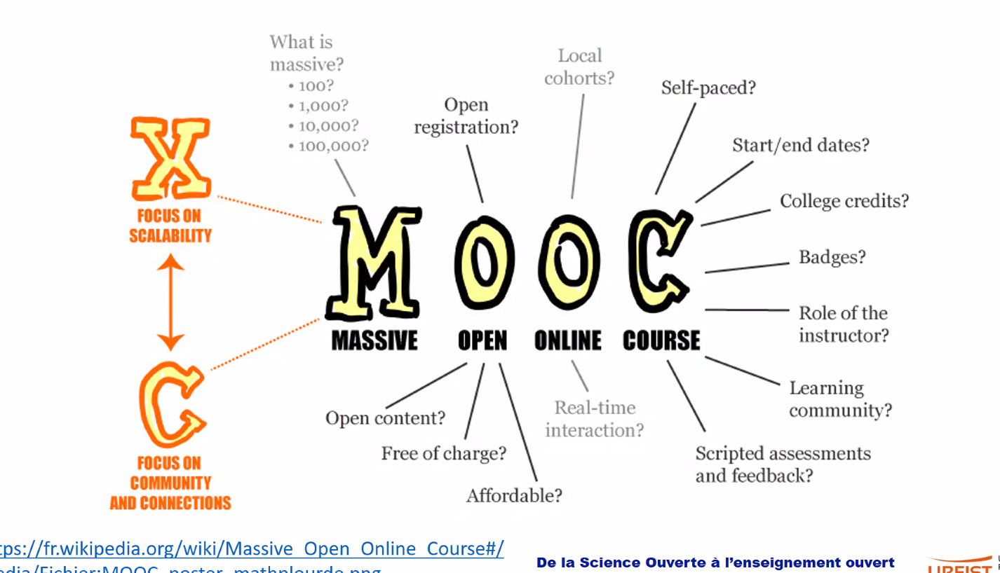

# 1 définition

Les ressources éducatives libres (REL) sont des ressources éditoriales destinées à l'enseignement et accessibles à tous les internautes. 
Il peut s'agir de [[manuels scolaires|manuels]], de cours, d'ouvrages destinés à l'enseignement
Ces documents peuvent avoir été libérés (suite à une souscription) ou conçus pour être directement diffusés sous [[licence libre]] (subventions à l'édition)

## 1.1 Valeurs des REL : 

- équité  
- diversité  
- inclusivité  

## 1.2 Caractéristiques des REL

- licence permettant la réutilisation ([[creative commons]])  
- Pas besoin de disposer d'une licence particulière à un produit pour pouvoir éditer et adapter le contenu (#focus)  
- transparence : ouvrir ses fichiers pour documenter la pédagogie qu'on a mise en place.  
- participation : faire que les apprenants participent le plus possible à leur apprentissage.  

# 2 Lien avec la Science Ouverte

## 2.1 Dans le sillage de l'open access pour les publications

Il s'agit de passer des [[Communs]] de la connaissance que sont les résultats scientifiques à des supports qui permettent de les transmettre aux citoyens, afin de rétablir des liens entre la Science et la société, liens abîmés par des vagues successives de désinformation. 
Les REL évoluent en lien et parallèlement à la [[science ouverte]].

[Déclaration de CapeTown](https://www.capetowndeclaration.org/) de 2007

Généalogie des REL liée à l'héritage des Sciences de l'Education où le partage des ressources est une habitude acquise depuis longtemps (cf. revue [Open Praxis](https://openpraxis.org/))

Les REL, issues d'une déclaration de l'UNESCO de 2002, complétée par celle  de 2012 et de 2019 pour le partage et l'appropriation des ressources pédagogiques à travers le monde [^1]. 

"restrictions limitées" : termes très sujet à interprétation. Problème identique aux thèses mises en ligne, celles-ci sont souvent expurgées de matériel sous droit qui serait nécessaire pour comprendre l'ensemble. 
Ce type d'ouverture restreinte peut avoir un aspect très frustrant. L'intérêt pédagogique devrait rester au-dessus de toute autre considération : remplacer autant que possible le contenu sous-droit par un contenu équivalent ou le recréer. 
Parallèle à faire avec l'ouverture de données publiques quasiment sans aucune documentation associée, ce qui les rend inutilisables : cf. les administrations et l'[[Open data]]. 

Ces définitions élaborées par l'UNESCO s'inspirent de la façon dont les publications ont été progressivement placées à la portée de tous les internautes (avec les différentes voies pour l'open access).

A tel point que certains proposent en France un Plan National pour les REL comme il en existe depuis 2020 pour la science ouverte[[@massouPourquoiNePas2022]]. 
Voir le rôle de l'Open Science Initiative ([OSI](https://osiglobal.org/)), think-tank qui s'est mis à promouvoir les ressources éducatives libres au moment où l'Europe met en place le [[Plan S]]. Lancement du [plan quinquennal de l'OSI](https://plan-a.world/overview/) en avril 2020 (au plus fort du [[confinement]] = déficit de notoriété y compris chez les professionnels du secteur).
Comme dans le cas d'un [[plan de gestion des données]], la création d'une REL consiste à anticiper avant la mise en oeuvre du projet les questions d'ouverture et de droits de propriété intellectuelle des logiciels utilisés et des compétences et participations sollicitées. 
Le formateur qui a pris l'habitude de monter ses supports seul va devoir travailler dans un cadre collaboratif et parfois transiger avec ses manières de faire si celles-ci ne sont pas assez "ouvertes".

Autre organisme de Science Ouverte impliqué dans la diffusion des REL : [SPARC](https://sparcopen.org/open-education/) : incitation à Appliquer la [[FAIR]]isation aux supports pédagogiques.

Question de la **propriété** des supports, ce n'est pas la même question que celle de la **paternité** des supports. Les BIATSS ont la paternité acquise de leurs supports réalisés sur le temps de travail, mais pas leur propriété (ce qui est le cas pour les enseignants chercheurs), cf [[droit d'auteur|droits d'auteurs]] 

Les "5 R" des ressources éducatives libres : 

- **Retain** : on peut faire une copie du support originel  
- **Revise** : adapter modifier  
- **Remix** : combiner avec une autre ressource  
- **Reuse** : recombine les trois premiers droits  
- **Redistribute** : permet de distribuer des copies du premier   

Réticences des chercheurs à partager "leurs" données : identique aux réticences des enseignants à partager "leurs" supports pédagogiques.
Crainte de se faire piller (cf imaginaire néo-libéral de la [[tragédie des communs]])
Crainte de voir l'intérêt des étudiants à participer au cours s'effondrer si les supports sont accessibles. Pourtant les supports ne devraient pas être pensés pour s'auto-suffire quand la séance doit avoir lieu en présentiel. 
Crainte d'exposer aux autres un travail dont on n'est pas satisfait. En effet, réaliser des REL, cela revient à s'exposer aux critiques, mais y répondre et modifier les supports en fonction de ces critiques améliore nos supports et fait de nous de meilleurs formateurs. 

Parfois, les mêmes répertoires sont utilisés pour recevoir des OER ou des articles déposés en Green OA (cf. Phaidra en Autriche)

## 2.2 Ouverture des fichiers périphériques au support

- un fichier [[Obsidian_README]] pour montrer comment utiliser le support  
- un versioning (pour avoir les premiers essais)  
- un document comportant du feedback anonymisé pour faire part de la réception par les étudiants du support. (difficulté à être transparent sur ses échecs ou les limites de ses dispositifs tels que vus par les étudiants qui les ont utilisés)  

## 2.3 enjeu de la reconnaissance des compétences acquises au moyen de REL : 

Enjeu de la reconnaissance des compétences acquises au moyen des REL : [[open badges]], cela permet de faire reconnaître des [[Savoirs]], des [[savoirs-faire]] et même dans certains cas des [[savoirs-être]]. 

*Q: Cela pose t-il un problème que les universités se mettent à délivrer des open badges pour des formations réservées à leurs étudiants, voire à une partie de leurs étudiants ?  
AB: pas du tout, c'est très courant. Les étudiants partent avec un badge, mais les employeurs ne peuvent pas savoir à quelles compétences ces badges font référence.   
Q: Merci, j'entends qu'on doit continuer à parler de ce problème de transparence des compétences liées au badges à nos services universitaires de pédagogie*  

Oberred : badges pour faire reconnaître les compétences en gestion des données. 

## 2.4 communautés REL

OE café événement UNESCO
Réseau des [champions des OER](https://zenodo.org/record/6594479)
Intérêt de faire grossir ces communautés pour un partage du travail équitable. Dans le cadre de l'ADBU, Zenodo (Compétences informationnelles) est une initiative intéressante de ce point de vue.

# 3 Méthodes de production des REL

## 3.1 comment financer les REL

Dès lors qu'il y a un modèle économique autour des formations et des enseignements (car l'enseignement a un coût), il faut que le coût soit partagé et que le modèle soit viable. 

## 3.2 Le cycle de production des REL

S'appuyer sur les compétences numériques propres aux bibliothécaires (importance pour cela d'intégrer Pix dans leur formation). cf Les 5 champs de [Pix](https://pix.fr). Ces compétences numériques deviennent nécessaires dans la formation du bibliothécaire (on parle de rajouter deux mois à la formation des conservateurs pour les intégrer)

Préparer le support en anticipant les questions de diffusion ([[DOI]] et [[Licences]])
Anticiper la diffusion : pourquoi Youtube, pourquoi pas CanalU ou Peertube ? 

Utiliser Hypothes.is pour avoir du feedback de la part des utilisateurs. 

Automatiser ou systématiser le fait d'avoir du feedback : sur quoi on interroge les utilisateurs ?

Structuration par modules

## 3.3 fairisation des supports

parallèle entre le schéma de Cécile Arènes (progressivité d'un jeu de données vers un format "science ouverte") et les 10 règles pour fairiser un support pédagogique.

Encore une fois, il faut systématiquement et en amont:
- planifier de partager son contenu en ligne, 
- puis il faut penser à les documenter (métadonnées + fichier [[README]]),
- donner à nos matériaux de formation une identité unique (identité graphique). Tout le monde n'est pas forcément en accord avec cette nécessité. 
- chercher un répertoire pérenne d'accès
- définir des règles d'accès (Licences)
- utiliser des formats interopérables  y compris à des formateurs en dehors de notre institution (genialy, klaxoon = à éviter)
- faire en sorte que d'autres formateurs puissent participer à l'amélioration de notre matériel. 

## 3.4 exemples de REL

### où trouver des REL

- Les supports de cours du MIT sont en ligne gratuitement. 
- supports communs aux universités québecoises
- universités numériques construites en 2003 (par exemple UNJF dans le domaine du droit, UVED dans le domaine du développement durable). Ces UN sont en lien avec FUN-Mooc. Ces universités montrent l'importance d'accompagner la prise en main des supports. Ouvrir des ressources n'est pas une fin en soi, nécessite de l'appropriation et de l'acculturation

*Q: Est-ce qu'il est possible en théorie de créer un cours sur un espace-cours du Moodle de son université et puis ensuite de le proposer à l'une des universités numériques pour qu'il y soit intégré ? 
R: Si notre université est membre d'une UN, il est possible de demander l'inclusion d'un espace-cours dans une université numérique. Cela dépend de l'intérêt de l'établissement pour les ressources pédagogiques produites en son sein. Pour Callisto, il a fallu passer un accord d'établissement à établissement.**

frustration de certains enseignants (ci-dessous au sein de Sciences Po) de ne pas pouvoir partager le support au delà du Moodle de l'établissement. 

### Vers une politique nationale des REL

[[@corealeComiteNumeriquePour]]

## 3.5 le cas des Mooc

open uniquement le temps de l'ouverture du MOOC, plus après (à moins qu'on s'y soit inscrit). Certification moyennant paiements : CoursEra, OpenClassrooms (totalement privé contrairement à FUN-Mooc)
Les Mooc ne sont pas compris dans les REL. 
On voit des initiatives de mise en ligne de Mooc auto-rythmés (cf. Mooc de Sorbonne Université sur la Science Ouverte)

Les SPOC (small private open classes) sont encore plus fermés que les Moocs.

Difficulté de mettre à jour les vidéos. en terme de FAIRisation, les vidéos ne sont pas un support à privilégier en raison des coûts de mise à jour. 

[Foster]([https://www.fosteropenscience.eu](https://www.fosteropenscience.eu/)) : les guides sont rédigés sur un site web : peu d'interactivité possible. 

La plateforme Callisto (Moodle), actuellement rédigée dans le cadre de l'UNIT pourrait devenir à terme une Université Numérique de plus dédiée à la science ouverte et à la documentation. 

Doranum : plateforme de formation pensée en auto-apprentissage. 
Site de Doranum : contenu rédigé avec [[Wordpress]], pas de DOI, moteur de recherche déficient, recherche par arborescence. 
Comment on [[FAIR]]ise ? transférer tout ou partie sur Callisto, sur Omeka ? 

Formadoct : encore sur Libguides, va basculer sur Callisto (ajouter de l'interactivité, des visuels, etc.)

Pour tous ces chantiers s'appuyer sur des formats libres privilégiés par l'administration ([socle des logiciels libres](https://sill.code.gouv.fr/list))

Intégrer les sujets d'examen aux ressources en ligne. De toute façon, c'est une obligation légale de les fournir quand ils sont demandés (cf. Règlement [[CADA]]). 

anciens supports sur Slideshare (racheté par LinkedIn) qui ont un coût en terme d'[[empreinte écologique]]. Faut-il les archiver ou les supprimer ? 

## 3.6 moteurs de recherche et entrepôts

liste de [[moteur de recherche|moteurs de recherche]] et d'entrepôts

- wikimedia commons  
- [oercommons.org](https://oercommons.org/)  
- enseignementsup-recherche.gouv.fr  
- [[Zenodo|zenodo]] 
- github et gitlab  

Intérêt d'utiliser Gitlab : 

- entrepôt auto-hébergé par l'université    
- git : excellent pour le versioning  
- écriture : format ouvert ([[Markdown]]), convertible en différents supports (PDF, odt, word, html)  
- habitude d'accompagner les dépôts d'un READme mis en avant lors du dépôt.   

Le ministère nous enjoint de ne pas déposer leurs datasets sur [[Zenodo]] parce qu'on y trouve de tout et du n'importe quoi, mais en même temps, l'ADBU nous incite à partager sur Zenodo des supports qui n'auraient pas lieu d'être sur [[HAL]]. Le paysage est très changeant sur ce sujet. 

$\newline$

# Bibliographie

$\newline$

[^1]: afin de promouvoir l'équilibre Nord-Sud, réduire les biais de genre dans l'accès à la formation et promouvoir la démocratie. 

