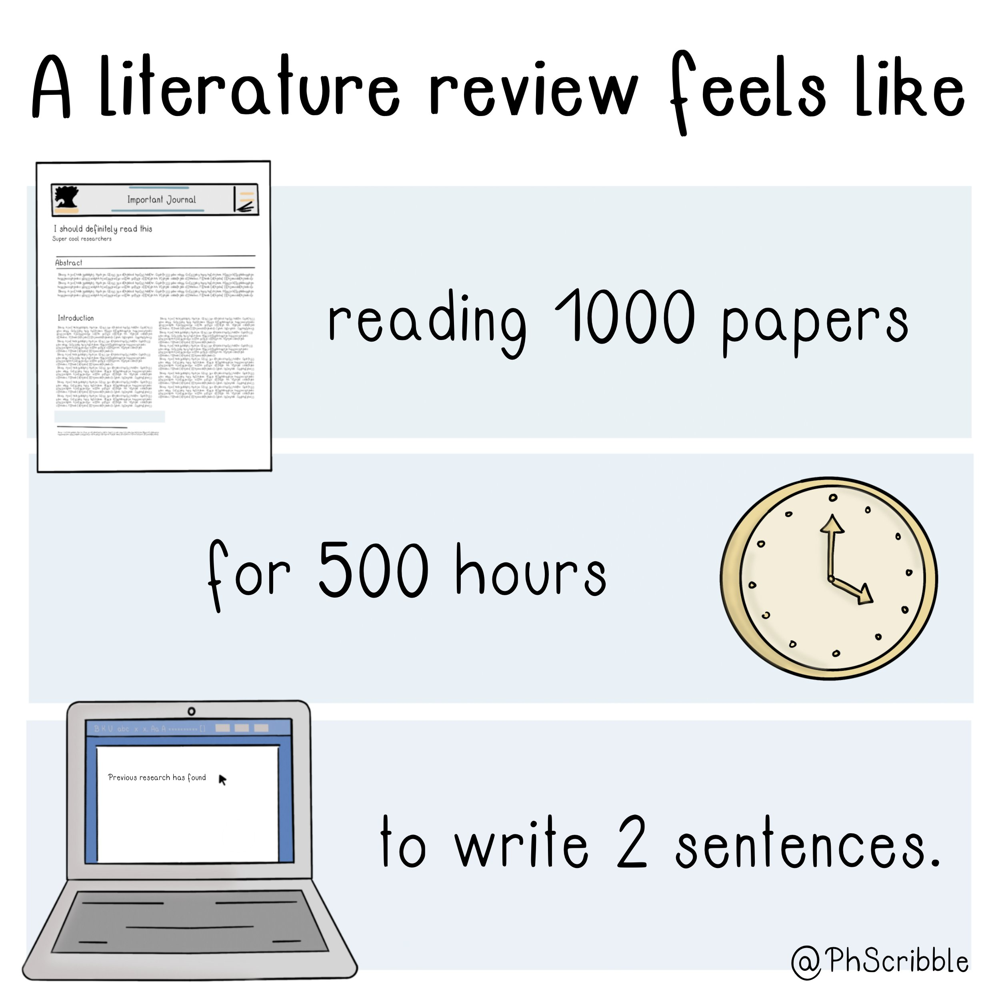
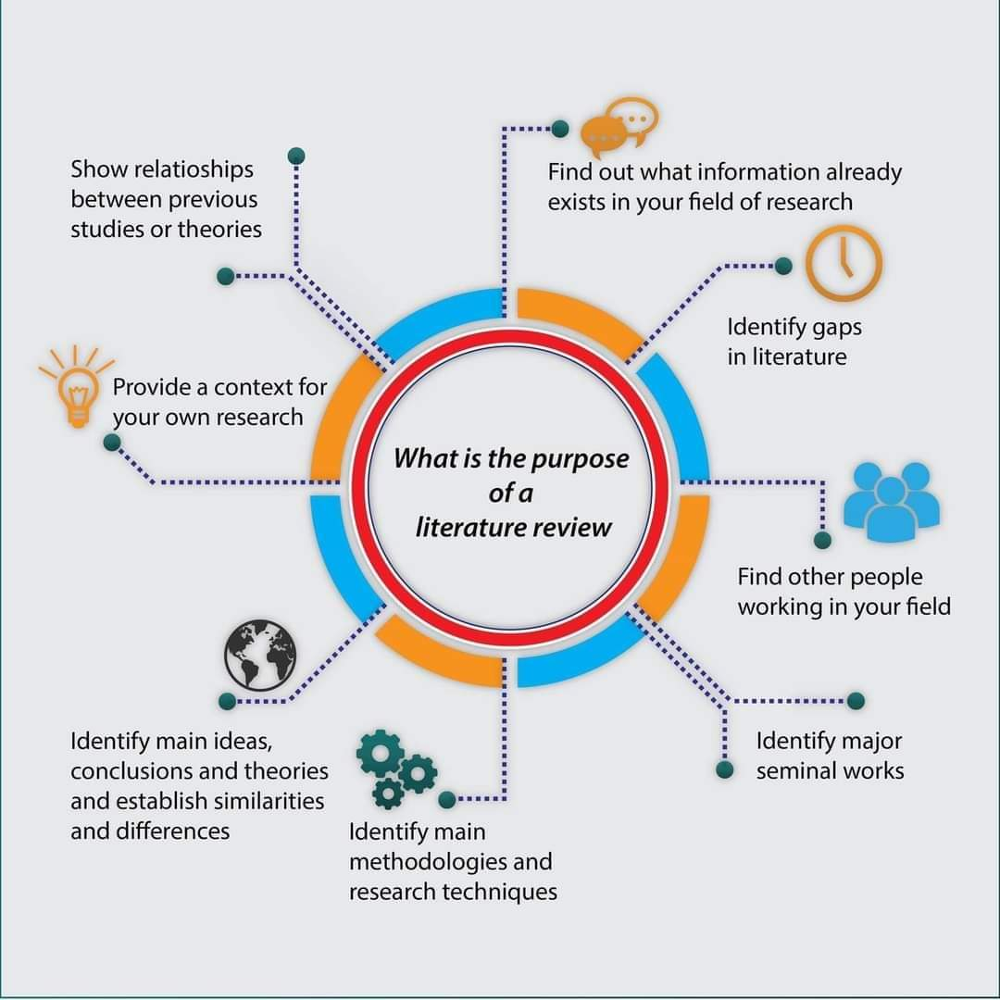
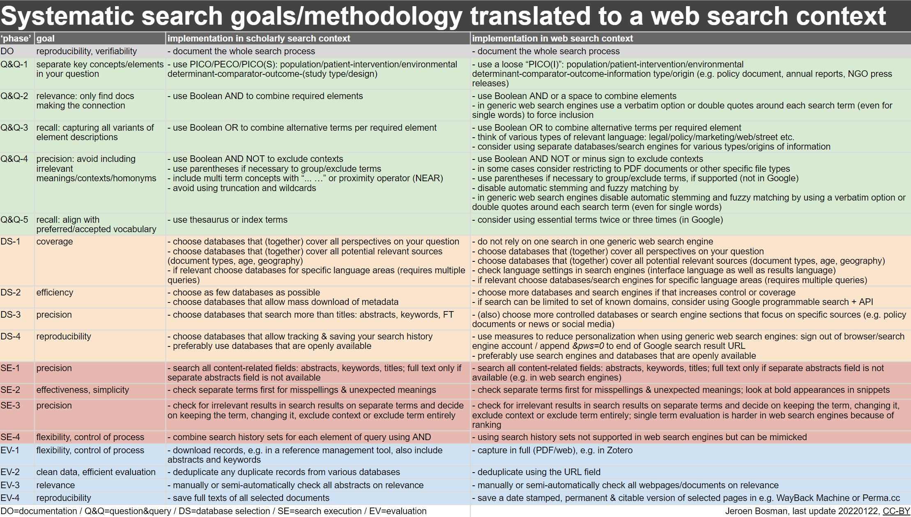
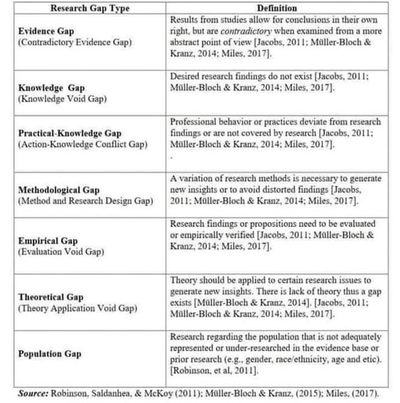
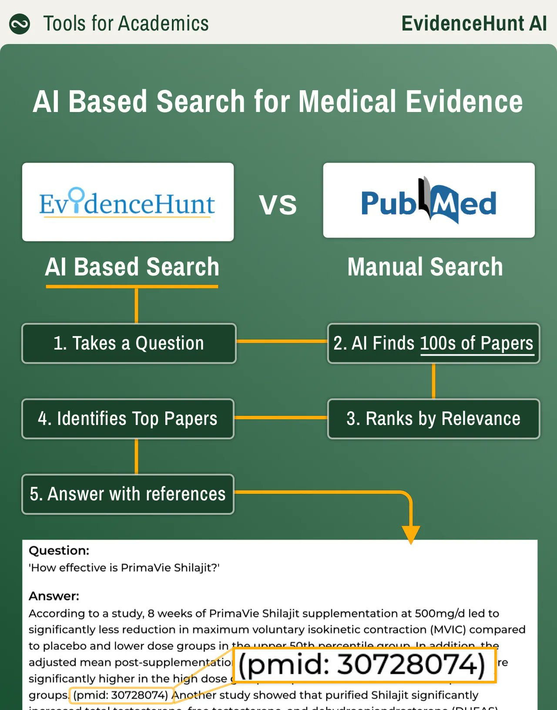

[[Support in the preparation of a systematic review]]

# 1. Qu'est-ce qu'une revue de littérature ? 


Autrement appelée Etat de l'art dans une thèse par exemple, cet exercice académique, parcours presque obligé consiste à faire l'état de la littérature sur une question avant d'aller plus loin. Dans le domaine de la santé, cette revue de littérature peut prendre la forme d'une [[revue narrative]], d'une [[revue systématique]] ou bien si on combine les chiffres des études en plus de leurs principales conclusions une [[méta-analyse]]

Buts généralement assignés à une revue de littérature : 



# 2. Le processus d'une revue de littérature 

Ensemble des opérations impliquées dans la revue de littérature (détaillées) par [Jeroen Bosman](https://twitter.com/jeroenbosman/status/1485003119184470016) (Université d'Utrecht)



# 3. Les différents types de revue de littérature

## revue narrative
voir [guide de la bibliothèque sur le sujet](https://focus.univ-rennes1.fr/revue_narrative)

### scoping review

On peut considérer la scoping review comme une vaste revue narrative qui pour une part reproduit les méthodes de la revue systématique. 
En tant que revue narrative, elle sera plus facilement appropriable par des  utilisateurs non spécialistes de la question ou non rompus à la technique de la revue systématique. La scoping review fait l'économie de certaines mesures qui caractérisent les méta-analyses (référence à la [[P-value|p-value]], poids statistique des études)

- revue focalisée sur un sujet d'étude, plus que sur les réponses à une question précise[[@PetersonUnderstandingscopingreviews2017]] : 

>Both meta-analyses and scoping reviews begin with a primary question on which inquiry is focused. However, a scoping review allows for a more general question and exploration of the related literature, rather than focusing on providing answers to a more limited question. 

- produit plus de résultats qu'une recherche systématique (plusieurs équations de recherche) parce qu'on va moins dans la profondeur (précision des réponses à une question) et plus dans le balisage du sujet [[@petersonUnderstandingScopingReviews2017]]. 

> For a systematic review, investigators generally start with a clearly defined question and explore and analyze high-level research studies focused on narrow parameters. Conversely, a scoping review has less depth but a broader conceptual range.

- permet de travailler sur un corpus de textes hétérogènes : 
      - articles de fonds, [[études cliniques]], méta-analyses
      - revu par les pairs ou littérature grise
      - étude quantitative ou qualitative

Ce que ne permettent pas la revue systématique ou la méta-analyse. 

- permet de clarifier les concepts clé du sujet
- permet de repérer des lacunes dans la littérature récupérée
- ne prend pas en compte la qualité des études (contrairement aux méta-analyses qui évaluent la qualité méthodologique des études utilisées). 
- permet de baliser le champ de recherches avant de se lancer dans des revues systématiques. 

## revue systématique

(à compléter)

## méta-analyse

(à compléter)

# 4. identification des lacunes dans la littérature scientifique


source: https://twitter.com/acagamic/status/1783511387551216028
# 4. les précautions à prendre dans la recherche

varier les [[usages]] des outils, se méfier des tris par pertinence (relevance), car ces tris favorisent dans les résultats les positions acquises (chercheurs masculins des Pays du Nord au détriment des chercheuses ou des chercheurs des Pays du Sud)
voir à ce sujet [[Citation#biais de genre et diversité]] et [[neutralité des algorithmes]] ou [[Bulle de filtre#La croyance en la neutralité de la technique s'applique aussi aux moteurs de recherche]] également [[@jordanMakeResearchMore2023]]

Les tris par pertience sont rarement définis (qu'est-ce qu'on appelle pour tel ou tel outil "pertinence")
nécessité de les mettre en off et de mener d'autres types de recherche. 
incitation à prendre en compte la diversité des résutlats (pour les journaux ou les universités)

# 5. mener une revue de littérature en utilisant des outils d'apprentissage profond

[EvidenceHunt](https://evidencehunt.com/chat) permet de poser une question clinique et d'obtenir des réponses ainsi que l'équation Pubmed qui a permis de l'obtenir. 
Possibilité aussi de faire une recherche avec la [[méthode PICO]]


le fonctionnement indiqué de cette [[grands modèles de langage]] est le suivant : 

A partir d'une question ( do coloring food additives have effects on children' attention deficit and hyperactivity disorders ) l'IA extrait la population (children) et l'intervention (food additives) pour trouver les meilleurs abstracts dans Pubmed. 

La requête utilisée est indiquée : 


```
(coloring food additives AND attention deficit hyperactivity disorder) OR (food dyes AND ADHD) OR (artificial colors AND hyperactivity in children) OR (food coloring AND behavioral problems in kids) OR (ADHD symptoms AND synthetic food dyes)
```
On peut constater ici que l'IA ne cherche pas utiliser de mots [[MeSH]]. Une requête faite par un bibliothécaire aurait la forme suivante : 

````mesh
("Food Coloring Agents"[Mesh]) AND "Attention Deficit Disorder with Hyperactivity"[Mesh]
````

La façon d'approcher la notion de pertinence n'est pas la même dans les deux cas. 
L'IA s'appuie sur un champ lexical de mots statistiquement proches (proximité constatée dans les abstracts entre food agents et food dyes ou synthetic food par exemple).

L'humain (en tout cas le professionnel de l'information) s'appuie sur une taxonomie réalisée par d'autres humains, le MeSH.

Au final seuls les résultats mesurés par l'algorithme de l'IA comme étant les plus pertinents apparaissent. (Dans ce cas 3 résultats, dont une méta-analyse)

Intérêts et limites de [[ChatGPT]] pour faire une revue de littérature : [[@qureshiAreChatGPTLarge2023]]

- selon la complexité de la question, ChatGPT fournit des critères plus ou moins fiables pour inclure ou exclure les études de la LR
- ChatGPT met l'accent sur l'exploitation de la conversation avec l'utilisateur plutôt que sur des méthodes balisées comme les équations de recherche incluant les [[opérateurs booléens]]. EvidenceHunt utilise davantage les booléens semble t-il. Dans certains cas, ChatGPG a frabriqué de toutes pièces du [[autorités matière|vocabulaire contrôlé]] qui n'existe pas. 
- ChatGPT peut fournir du code pour un traitement des [[données de la recherche|données de recherche]] avec [[R (logiciel)]] ou [[Python]], mais ce code contient des erreurs et doit être corrigé à la main. 
- pour la génération d'une synthèse à partir des résumés d'études pertinents, l'IA fait le travail mais avec quelques erreurs au passage. 
- ChatGPT fait référence à des études qui n'existent pas.


> In its current form, ChatGPT presents as an “uncanny valley” in research and information sciences: from a distance, the output mimics and passes as authentic; however, on closer inspection, it becomes apparent that it is not expertly formed material based on a depth of understanding of the systematic review process. A particularly strong limitation of the system is the lack of referencing appropriate and verifiable sources when asked for factual information. When we asked for references, we could not verify what it presented to us. This is a common occurrence as LLMs are designed to build a response using predictions and not by looking through literature to find real sources


synthèse d'Aline Bouchard sur la revue de littérature avec les outils d'IAG [[@bouchardWorkInProgressIAGenerative2025]]

# Accompagnement dans les Revues de littérature

Accompagnement réalisé par le SCD de l'Université de Rennes, voir [[Accompagnement dans les revues de littérature]]


# Bibliographie


