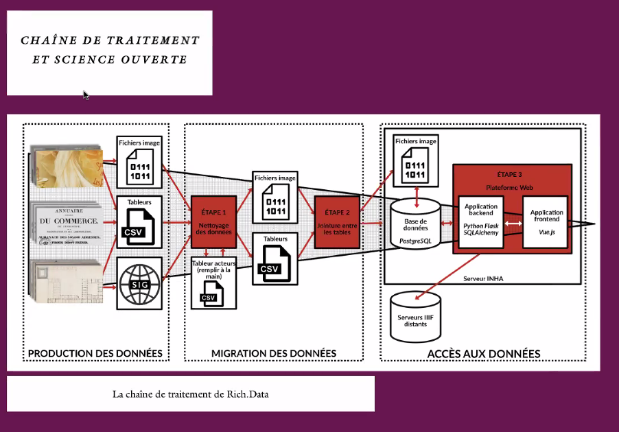
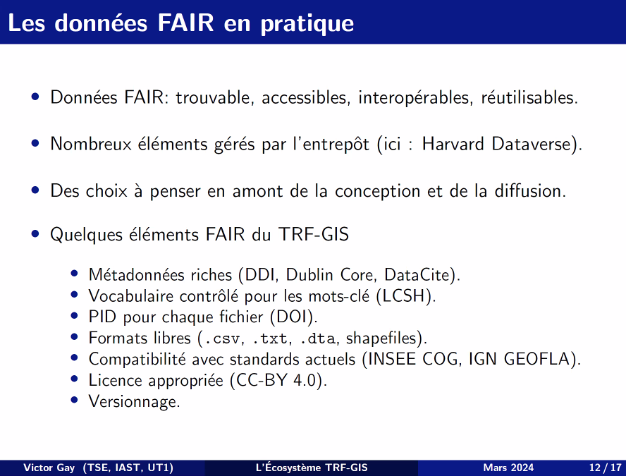

Webinaire organisé par le GTSO Couperin

# Réutilisation de données dans les études médiévales

Thibaud Clétice, Alix Chagué
[[Océrisation]] de textes médiévaux
HTR prédiction d'un contenu textuel à partir d'une image, prédiction réalisée par une IA entrainée par une IA. 

modèles = données de recherche ? 

1. Chargement des images
2. Texte droit
3. segmentation du texte en lignes
4. récupération du texte par lignes

Apprendre à reconnaître les zones, les lignes puis les caractères.

[[OCR]] = imprimé, HTR manuscrit

Jusqu'à présent pour toute période antérieure au XIXème siècle 

2 coûts pour les modèles : 
accéder à des données dentraîenment
coût de l'entraînement des modèles

Trouver des modèles qui pré-existent et qui permettent de traiter les images

Les modèles ou les données ne sont pas forcément [[FAIR]] 7 caractères unicodes permettent de traduire un tiret sur un imprimé. 
problème des licences peu claires sur les modèles; 

HTR United : créer un catalogue consultable par les humains ; exploitable par les machines,  pour accéder aux données. Catalogue ouvert aux soumissions, alimenté par les producteurs de jeux de données. La plupart du temps, le travail de catalogage est fait par les soumissionnaires. 
guide pour déposer les données, webform en ligne, intervention sur le jeu de données (à la manière des *issues* sur Github). 85 jeux de données, 21 langues représentées, 8 écritures différentes (chinois, latin (majoritaire), sanskrit, hébreu, etc.)
documents manuscrits ou imprimés (800 - 2023) 43 millions de caractères, 1 million de lignes, 40 jeux de données manuscrites
HTR United : [[autorités matière|vocabulaire contrôlé]] et schéma de [[métadonnées]]. Mélanger des jeux de données peut être un peu complexe. Que faire avec les abréviations ? comment les traduire ? L'ensemble des jeux de données peuvent être cités en caractérisant leurs rôles ([[ORCID]]). Schéma ouvert, 4ème version, disponible sur [[Github]]. (choix de la [[forge logicielle]] lié à l'accroissement subit du projet - archivage du catalogue réalisé sur [[Zenodo]]) HTR united : boîte à outil et catalogue. Les jeux de données sont catalogués sur HTR mais hébergés sur les githubs des producteurs des jeux de données.

s'assurer de la réutilisabilité à partir du schéma. 

HTR United applique les principes FAIR et tend à reconnaître la part scientifique prise  par la mise à disposition de donnnées ouvertes. 
Perspective : associer à HTR United un catalogue de data papers. 
Rendre plus facile la connexion du catalogue à des outils de programmation. 
https://github.com/HTR-United
Curation réalisée au dépôt par Alix Chagué ou Thomas Clérice

# Histoire du quartier Richelieu 

Auteurs: Charlotte Duvette Paul Kervegan

Agrégation d'images produites par des acteurs du quartier
approche iconographique, cartographique et textuelle
Prendre un échantillon urbain et se demander à partir d'un échantillon urbain comment on en est arrivé à l'état actuel du quartier (projet exploratoire)
Sources : bases de données iconographiques et textuelles en Histoire de l'Art (par exemple Paris Musées) ; images numérisées en haute définition + métadonnées. 
Pour la Place de la Bourse, 4000 images très hétérogènes- sont disponibles (dessins, relevés, photographies, menus de restaurant, extraits de journaux illustrés, relevés architecturaux)
[[entités nommées]] extraites manuellement (acteurs, noms de bâtiments, noms de rue).

base de données ProgreSQL ([[logiciel libre]])

# Un SIG pour la France de la Troisième République

Présentation de Victor Gay

Datapaper : outil essentiel pour la réutilisation et la valorisation des données de recherche

16 bases de données correspondant à différentes divisions administratives de l'espace. 
Données accessibles dans le Dataverse de Harvard, référence sur [[RDG]]
[datapaper sur le projet](https://www.tandfonline.com/doi/abs/10.1080/01615440.2021.1937421)
Utilisation d'un [[SIG]] pour les divisions administratives de la 3ème république

Crise de [[reproductibilité]] en Sciences Sociales -> données mises en accès à toutes et tous et commentées sous la forme d'un [[data paper]]. 

Réutilisation de plusieurs bases de [[open data|données ouvertes]] 

[[FAIR]] : interopérabilité mise en oeuvre selon les normes de l'INSEE et l'[[IGN]]. 

# Réutilisation des données en santé

(cf. [[National Tripartite Event EOSC-FRANCE]])

réutilisation de données de neuro-imagerie en conformité avec le [[RGPD]], voir projet [[Shanoir]], présenté par Camille Maumet (ARDoISE)

$\newline$
# bibliographie
$\newline$

