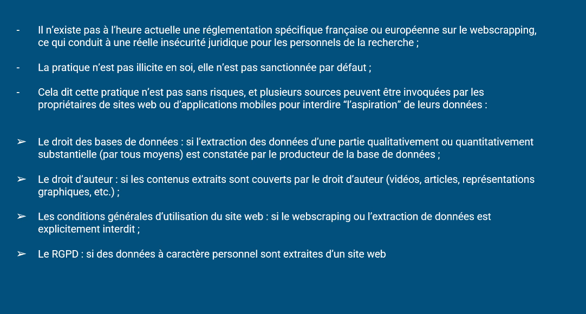

# Aspects légaux

voir [[Droit des données de recherche#Data Mining, web scraping, OSINT]]

# scraper des résultats provenant de plusieurs pages de résultats

extension  web scraper pour Chrome
[tutoriel](https://www.stretchingnumerique.fr/admin/structure/webform/submissions/manage) 

harvest sur [[R (logiciel)|R]]
Mais les sites se protègent de plus en plus. 

# Obstacles au scraping

Pour se garantir contre l'exploitation de leurs contenus par des producteurs d'outils d'IA, type OpenAI, les sites se dotent de plus en plus de moyens techniques destinés à les protéger de l'aspiration de leurs données selon une étude réalisée à partir de l'analyse des droits indexés dans le fichier robot.txt d'une et dans leur GCU de 14000 sites web en 2023 et 2024. En 2023, le nombre de sites provenant de ce corpus et disposant d'un fichier robot.txt interdisant le scraping est passé de 2% à 30%.
Cela laisse planer des difficultés pour les futurs concepteurs de [[grands modèles de langage|LLM]] si une parade technique pouvait en effet empêcher l'utilisation de ces données comme le prévoit ces fichiers. Les LLM se basant sur un nombre de sites toujours plus limités pourraient manquer de diversité et devenir de plus en plus biaisés. [[@longpreConsentCrisisRapid2024]]

