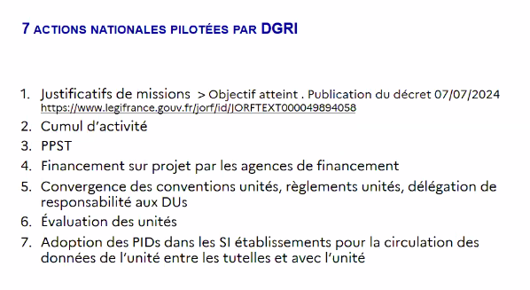
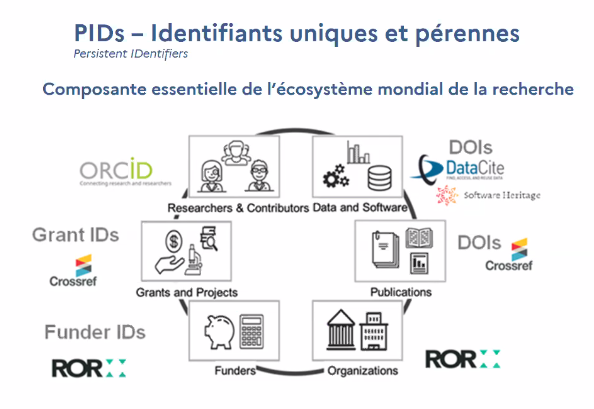
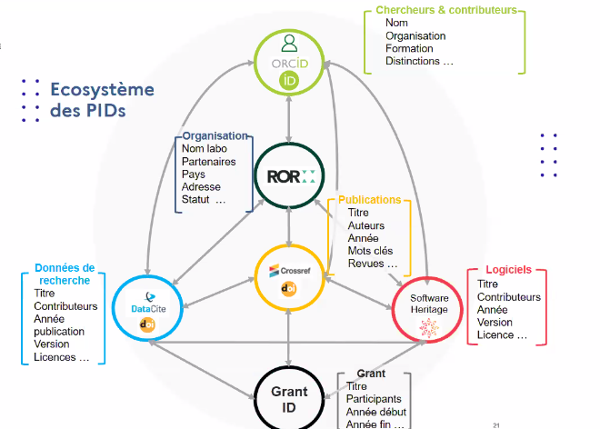
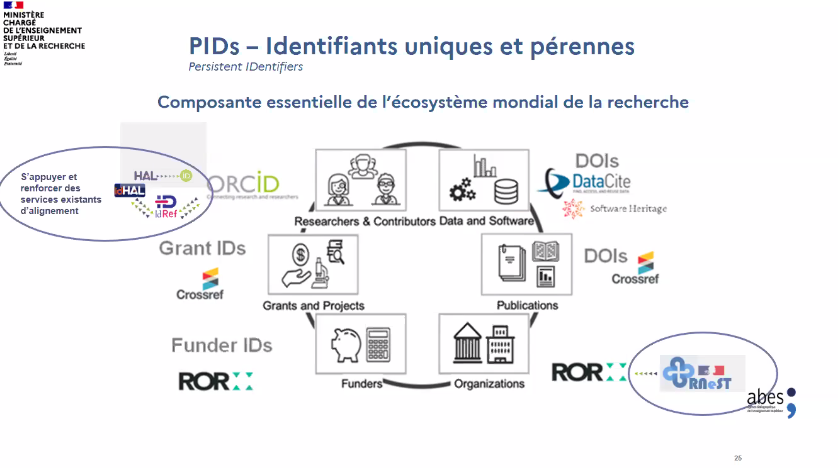
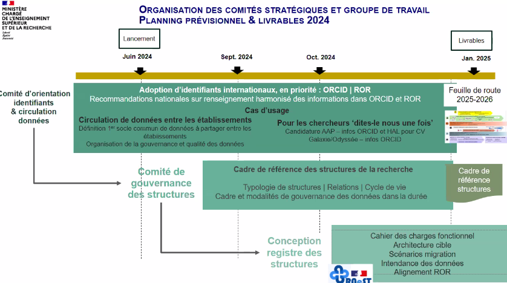

# Présentation d'Isabelle Blanc

Cette stratégie vise à la simplification (au sens de "réduction de charge administrative") des organismes de recherche (cf. [rapport 2023 de la mission Philippe Gillet sur l'organisation de la recherche en France](https://www.enseignementsup-recherche.gouv.fr/fr/remise-du-rapport-de-la-mission-gillet-sur-l-ecosysteme-de-la-recherche-et-de-l-innovation-91274))

Appui sur les identifiants internationaux de la recherche
objectif de réduire les contraintes administratives pesant sur les chercheurs
17 sites universitaires pilotes de cette action qui essaient d'intégrer ces [[identifiants uniques et pérennes|identifiants uniques]] dans leur [[Système d'information|SI]]

pilotage assuré par le comité de pilotage simplification DGRI (resp. ANR, IGESR, DGSIP, DGRI, ONR) et le pré-comité de pilotage simplification présidé par la DGRI

**bénéfices recherchés**

- fluidité des échanges de la donnée  
- capitalisation de la donnée  
- réduction de la redondance administrative pour les chercheurs et les unités ("dites-le nous une fois")  

Tout cela sans imposer un SI unique à tout le monde.

Les obstacle à la circulation des données entre établissements ne tiennent pas à un manque de volonté, à des limites juridiques ni à des SI non interopérables, mais à l'incapacité d'identifier des unités de recherche de manière univoque : pas d'identifiant unique ni de description commune. 

Levier d'action : usage d'utilisation d'identifiants pérennes (PID) internationaux et nationaux

[[ORCID]], [[ROR]], [[DOI]], SWHID(identifiant de code source de [[Software Heritage]]), pour d'autres infos sur ces PID voir [les infos sur le site Doranum](https://doranum.fr/identifiants-perennes-pid/identifiants-perennes-fiche-synthetique_10_13143_7gw1-b340/)

Présentation de ces différents identifiants et de leurs articulation. 

Grant ID : financements donnés par l'[[ANR]] par exemple, cette métadonnée est à entrer dans les notices de [[HAL]] et de [[Recherche data gouv]]

stratégies déjà adoptées par l'Australie et le Royaume-Uni ; des études ont montré les bénéfices qui en ont suivi. 
La [[Research Data Alliance|RDA]] a mis en place un groupe d'intérêt sur le sujet de ces stratégies. 

Les informations dans ROR sont insuffisantes pour ce qui concerne les organismes de recherche français. Le RNSER est complété par chacun, mais ne peut pas servir de référentiel certifié. Nécessité de construire un référentiel français interopérable avec ROR qui fasse foi pour tout le monde et qui reflète l'historique de transformation des structures. 

Ce registre de confiance s'appellera RNEST

Plateforme unique de dépôt des candidatures aux appels d'offre postés par différents organismes de financement, cette plateforme favorise une connexion via l'identifiant [[ORCID]], la plateforme est interopérable avec HAL et ORCID (dans les deux sens).

Réduire la charge administrative

- pour les établissements : simplification du pilotage de la recherche
- pour les chercheurs : dites le nous une fois
- autres bénéficiaires : accès à des données de référence

Principes directeurs : 
1. Un travail collaboratif et une gouvernance ouverte (les comités et groupes de travail seront représentatifs de l'ensemble des organisations et métiers)
2. autonomie des établissements (respect des SI locaux dans leur diversité)
3. circulation et interopérabilité des données
4. cas d'usagers et usagers (premiers cas d'usages dès 2025)

# Séance de questions / réponses

Rnest sera intéroperable avec AureHAL, Rnest sera d'ailleurs administré par l'ABES. 

Remarque de Luc Bellier : les chercheurs de l'ESR ont un numen pas les chercheurs du ministère de l'agriculture, l'ORCID est un pont entre ces deux mondes. Son adoption est cruciale par les chercheurs et chercheuses. Mais c'est plutôt les financeurs et les éditeurs qui mettent la pression sur les chercheurs pour l'adoption des ORCID, assez peu les établissements de recherche eux-mêmes. nécessité d'aligner ORCID et IdHAL

Rnest est une évolution du RNSR (transformation d'un répertoire en registre de confiance avec un travail d'alignement pour permettre la migration des données)

Ce sont les établissements qui au terme de leur processus d'évaluation renseigneront la base Rnest. 

Question de David Aymonin sur [[Wikidata]] : quelle place pour Wikidata dans la stratégie nationale ? Réponse évasive d'Isabelle Blanc sur Wikidata, apparemment ça ne paraît pas prioritaire. IB dévie la question vers les identifiants SIREN.

faut-il continuer de mettre à jour le ROR ? Oui, mais il faudra prévoir une harmonisation sur le renseignement par chaque équipe de ce registre. 

Thierry Fournier ; quand sera publié le cadre de référence : Réponse : vers mars. 

