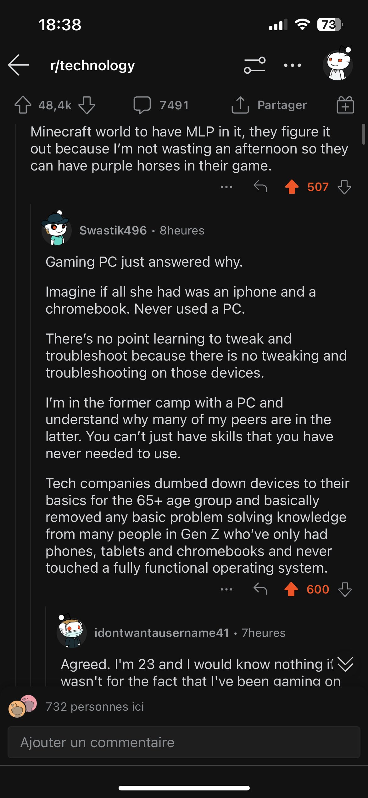

Présentation des apps sur un smartphone ou une tablette. toucher une icone démarre une application. Fonctionnement tout à fait différent des PC (où le système d'exploitation gère des fichiers qu'il faut ensuite exécuter, parfois en lignes de commande)

Effet du surface computing sur la génération Z : 

[[@chinStudentsWhoGrew2021a]]

Voir aussi sur [Twitter](https://twitter.com/MenicaFolden/status/1619830226707693568) 

cf. [post de Olivier Simard-Casanova](https://fed.brid.gy/r/https://bsky.app/profile/did:plc:esmiuxk53vmsllayghrq676w/post/3l66hek6anc2z) 

voir [[prolétarisaton]]

Même proposition chez Marcello Vitali-Rosati : les outils des [[GAFAM]] ne permettent pas de se rendre compte de leur fonctionnement : pas d'accès au chemin des fichiers 

> Nos dispositifs GAFAM suivent le même paradigme de dissimulation. Dans les systèmes d'exploitation comme Mac et Windows, nous ne pouvons, par exemple, plus voir l'emplacement des fichiers ni leur extension. Les personnes sont de moins en moins conscientes du fait qu'un ordinateur a un stockage des informations organisé avec une structure arborescente. 

(source : [[@vitali-rosatiElogeBugEtre2024]], p85)

