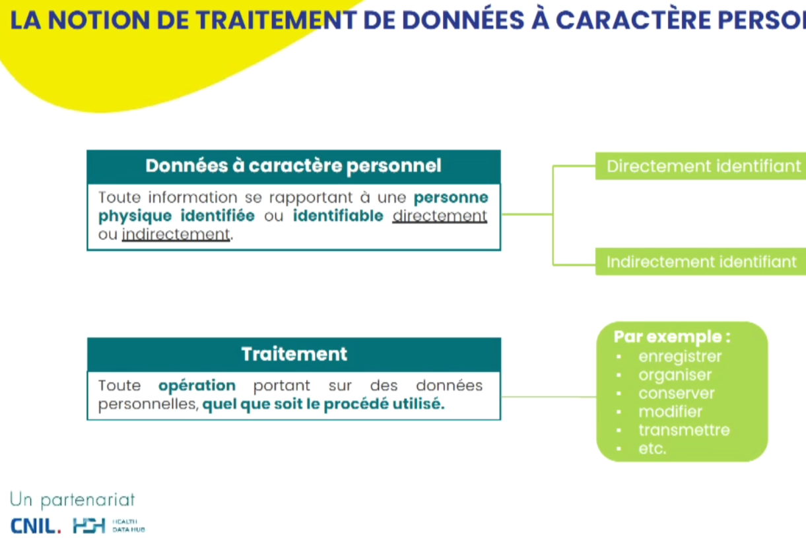

# traitement de données de santé

voir [[SNDS]]

La CNIL n'autorise pas en soi un dispositif technique de traitement de données personnelles sans finalité. La finalité du traitement doit être conforme à l'une des bases légales (intérêt public pour la recherche ou intérêt légitime pour les acteurs commerciaux)

$\newline$
# bibliographie
$\newline$

