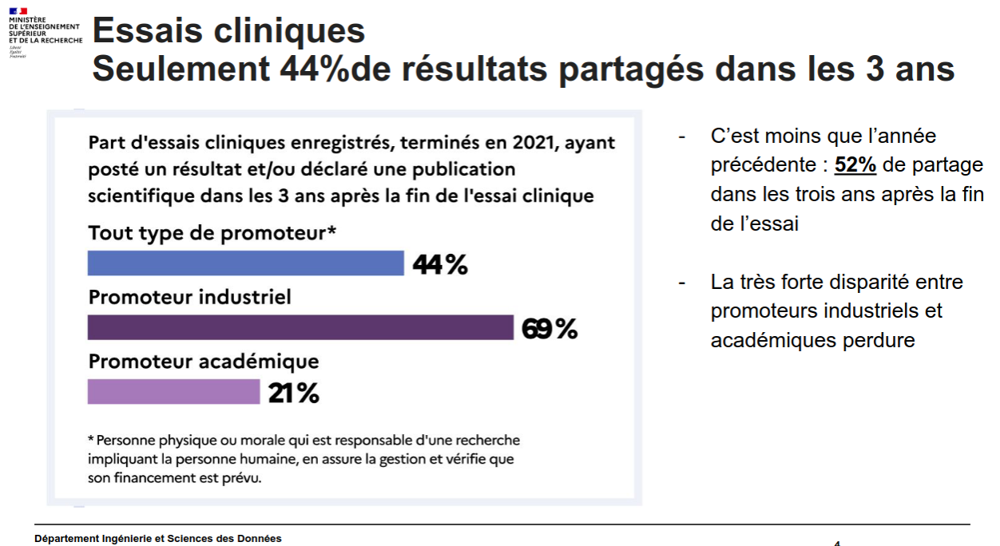

# Histoire du concept

Années 20, mesure de l'effet d'un nouvel engrais sur des parcelles d'avoine choisies aléatoirement (Ronald Fischer publie un article sur sa méthode en 1926). Cette méthode va devenir la norme dans les études cliniques, mais va se répandre aussi dans les agences chargées de l'évaluation des politiques publiques aux Etats-Unis et au Canada. 
Les RCT servent également de base aux géants du numérique pour se livrer à des expériences en continu sur leurs utilisateurs afin de tester de menus changements d'interface et déterminer ainsi quelle disposition permet le mieux d'obtenir le comportement souhaité (clic + achat)
(source : [[@durandTechnofeodalismeCritiqueEconomie2023]], p111)

# obligation de publication

charte d'Helsinki : on doit publier (par exemple sur  Clinicaltrials.gov) tout projet d'étude clinique impliquant des humains avant le recrutement du premier patient. 
tous les résultats de ces études doivent être publiés (au sens d'enregistrés et rendus publics sur un site)

C'est loin d'être le cas, une étude de 2024 montre que seulement 47% des résultats des études cliniques sont en accès ouvert. Le score de publication ouverte empire avec l'industrie et s'améliore avec la recherche publique, en moyenne il faut attendre 2 ans avant qu'une étude clinique soit en accès ouvert, plus les études cliniques sont solides et plus elles sont en accès public.  [[@brucknerCochraneReview472025]]

> Le score de publication ouverte empire avec l'industrie et s'améliore avec la recherche publique, en moyenne il faut attendre 2 ans avant qu'une étude clinique soit en accès ouvert, plus les études cliniques sont solides et plus elles sont en accès public.

ce n'est pas exactement la représentation que l'on en a au niveau français (voir chiffres BSO 2025)

obligation de publication peu respectée : 

[[@jeangirardBarpmetreScienceOuverte2025]]
# dépôt du protocole de l'essai

autrement dit "rapport de [[pré-enregistrement de publications|pré-enregistrement]]"
Lieu de dépôt : OSF

# Etudes cliniques et protection des données sensibles

- cadre légal : Loi Jardé sur les [[RIPH]] : https://www.inserm.fr/nos-recherches/recherche-clinique/la-recherche-clinique/
- [[RGPD]]

#  Récupérer des essais cliniques dans Medline

voir [[méthode Cochrane HSSS]]

# bibliographie

